# SEO优化系统

<cite>
**本文档引用的文件**
- [app/layout.tsx](file://app/layout.tsx)
- [app/robots.ts](file://app/robots.ts)
- [components/ui/breadcrumb.tsx](file://components/ui/breadcrumb.tsx)
- [app/api/sitemap/route.ts](file://app/api/sitemap/route.ts)
- [components/analytics/GoogleAnalytics.tsx](file://components/analytics/GoogleAnalytics.tsx)
- [lib/i18n/config.ts](file://lib/i18n/config.ts)
- [messages/en.json](file://messages/en.json)
- [sanity/sanity.config.ts](file://sanity/sanity.config.ts)
- [sanity/schemas/product.ts](file://sanity/schemas/product.ts)
- [sanity/schemas/article.ts](file://sanity/schemas/article.ts)
- [app/admin/geo-dashboard/page.tsx](file://app/admin/geo-dashboard/page.tsx)
- [app/api/geo/score/route.ts](file://app/api/geo/score/route.ts)
- [lib/geo/geo-score.ts](file://lib/geo/geo-score.ts)
- [lib/geo/ai-citability.ts](file://lib/geo/ai-citability.ts)
- [lib/geo/ai-crawlers.ts](file://lib/geo/ai-crawlers.ts)
- [lib/geo/llmstxt.ts](file://lib/geo/llmstxt.ts)
- [app/llms.txt/route.ts](file://app/llms.txt/route.ts)
- [app/robots.txt/route.ts](file://app/robots.txt/route.ts)
- [components/products/ai-citability-block.tsx](file://components/products/ai-citability-block.tsx)
- [data/led-glossary.ts](file://data/led-glossary.ts)
- [scripts/test-geo-seo.ts](file://scripts/test-geo-seo.ts)
</cite>

## 更新摘要
**所做更改**
- 新增GEO（Generative Engine Optimization）AI驱动SEO框架章节
- 添加AI Citability内容优化系统
- 新增AI爬虫管理与llms.txt导航文件
- 更新SEO评分系统与审计报告功能
- 增强AI搜索引擎优化策略与监控面板
- 新增llms.txt和robots.txt的AI优化配置
- 新增LED术语库与AI优化定义功能
- 新增GEO功能测试脚本

## 目录
1. [简介](#简介)
2. [项目结构](#项目结构)
3. [核心组件](#核心组件)
4. [架构总览](#架构总览)
5. [详细组件分析](#详细组件分析)
6. [GEO AI驱动SEO框架](#geo-ai驱动seo框架)
7. [依赖关系分析](#依赖关系分析)
8. [性能考虑](#性能考虑)
9. [故障排除指南](#故障排除指南)
10. [结论](#结论)
11. [附录](#附录)

## 简介
本文件面向GoPro Trade网站的SEO优化系统，系统性梳理结构化数据生成（产品Schema、网站结构、面包屑导航）、元数据管理（标题、描述、关键词）、图片SEO优化（压缩、格式、alt标签、懒加载）、URL结构优化（多语言、产品详情页、分类URL）、搜索引擎索引策略（robots.txt、sitemap.xml、Google Search Console集成），以及SEO性能监控与分析工具的使用指南。**新增**GEO（Generative Engine Optimization）AI驱动SEO框架，包括AI内容优化、AI爬虫管理、SEO评分系统和监控面板，提供智能化的搜索引擎优化解决方案。

## 项目结构
该Next.js应用采用多语言路由与内容管理驱动的结构化组织，**新增**AI SEO优化基础设施：
- 多语言路由：`app/[locale]/...`，通过`lib/i18n/config.ts`定义语言集合与默认语言
- 内容管理：Sanity CMS定义产品与文章的Schema，支持6语言字段与SEO字段
- SEO基础设施：根布局元数据、robots.txt、动态sitemap、面包屑结构化数据、分析脚本
- 国际化消息：`messages/*.json`提供页面文案与元数据键值
- **GEO框架**：AI内容优化、AI爬虫管理、SEO评分系统、监控面板
- **AI优化配置**：llms.txt导航文件、AI爬虫优化的robots.txt
- **LED术语库**：AI优化的技术术语定义与搜索功能

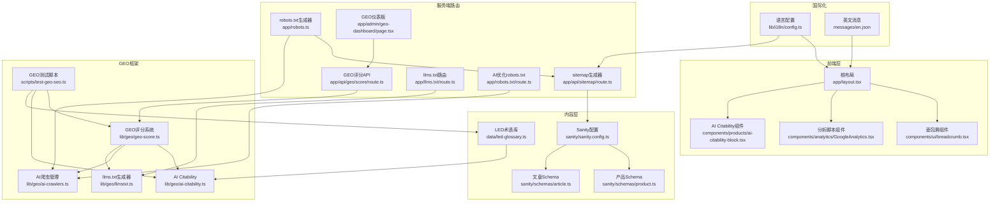

**图表来源**
- [app/layout.tsx:1-19](file://app/layout.tsx#L1-L19)
- [components/ui/breadcrumb.tsx:1-87](file://components/ui/breadcrumb.tsx#L1-L87)
- [components/analytics/GoogleAnalytics.tsx:1-93](file://components/analytics/GoogleAnalytics.tsx#L1-L93)
- [app/robots.ts:1-27](file://app/robots.ts#L1-L27)
- [app/api/sitemap/route.ts:1-100](file://app/api/sitemap/route.ts#L1-L100)
- [lib/i18n/config.ts:1-16](file://lib/i18n/config.ts#L1-L16)
- [messages/en.json:1-200](file://messages/en.json#L1-L200)
- [sanity/sanity.config.ts:1-33](file://sanity/sanity.config.ts#L1-L33)
- [sanity/schemas/product.ts:1-233](file://sanity/schemas/product.ts#L1-L233)
- [sanity/schemas/article.ts:1-265](file://sanity/schemas/article.ts#L1-L265)
- [app/admin/geo-dashboard/page.tsx:1-341](file://app/admin/geo-dashboard/page.tsx#L1-L341)
- [app/api/geo/score/route.ts:1-79](file://app/api/geo/score/route.ts#L1-L79)
- [lib/geo/geo-score.ts:1-351](file://lib/geo/geo-score.ts#L1-L351)
- [lib/geo/ai-citability.ts:1-196](file://lib/geo/ai-citability.ts#L1-L196)
- [lib/geo/ai-crawlers.ts:1-277](file://lib/geo/ai-crawlers.ts#L1-L277)
- [lib/geo/llmstxt.ts:1-164](file://lib/geo/llmstxt.ts#L1-L164)
- [app/llms.txt/route.ts:1-28](file://app/llms.txt/route.ts#L1-L28)
- [app/robots.txt/route.ts:1-20](file://app/robots.txt/route.ts#L1-L20)
- [components/products/ai-citability-block.tsx:1-178](file://components/products/ai-citability-block.tsx#L1-L178)
- [data/led-glossary.ts:1-149](file://data/led-glossary.ts#L1-L149)
- [scripts/test-geo-seo.ts:1-86](file://scripts/test-geo-seo.ts#L1-L86)

**章节来源**
- [app/layout.tsx:1-19](file://app/layout.tsx#L1-L19)
- [lib/i18n/config.ts:1-16](file://lib/i18n/config.ts#L1-L16)
- [sanity/sanity.config.ts:1-33](file://sanity/sanity.config.ts#L1-L33)

## 核心组件
- 根布局元数据：集中定义站点标题与描述，作为默认SEO基线
- 面包屑导航：自动生成JSON-LD BreadcrumbList结构化数据，提升搜索结果丰富性
- 动态sitemap：按语言与页面类型生成XML sitemap，包含图片信息
- robots.txt：控制爬虫访问范围与sitemap地址，**新增**AI爬虫管理
- 分析脚本：集成GA4，支持SPA路由追踪与事件上报
- 国际化配置：统一语言集合、默认语言与RTL支持
- Sanity Schema：产品与文章的多语言字段与SEO字段，支撑动态元数据
- **GEO评分系统**：AI驱动的SEO综合评分与审计报告
- **AI Citability内容**：生成易于AI引用的内容块，优化AI搜索表现
- **llms.txt导航文件**：为AI爬虫提供网站结构指导
- **AI优化robots.txt**：智能控制AI爬虫访问策略
- **LED术语库**：AI优化的技术术语定义与搜索功能
- **GEO测试脚本**：验证AI SEO功能的自动化测试工具

**章节来源**
- [app/layout.tsx:1-19](file://app/layout.tsx#L1-L19)
- [components/ui/breadcrumb.tsx:15-42](file://components/ui/breadcrumb.tsx#L15-L42)
- [app/api/sitemap/route.ts:8-14](file://app/api/sitemap/route.ts#L8-L14)
- [app/robots.ts:3-26](file://app/robots.ts#L3-L26)
- [components/analytics/GoogleAnalytics.tsx:37-68](file://components/analytics/GoogleAnalytics.tsx#L37-L68)
- [lib/i18n/config.ts:1-16](file://lib/i18n/config.ts#L1-L16)
- [sanity/schemas/product.ts:148-187](file://sanity/schemas/product.ts#L148-L187)
- [sanity/schemas/article.ts:188-228](file://sanity/schemas/article.ts#L188-L228)
- [app/admin/geo-dashboard/page.tsx:32-80](file://app/admin/geo-dashboard/page.tsx#L32-L80)
- [lib/geo/geo-score.ts:8-28](file://lib/geo/geo-score.ts#L8-L28)
- [lib/geo/ai-citability.ts:12-17](file://lib/geo/ai-citability.ts#L12-L17)
- [lib/geo/llmstxt.ts:8-14](file://lib/geo/llmstxt.ts#L8-L14)
- [app/llms.txt/route.ts:9-27](file://app/llms.txt/route.ts#L9-L27)
- [app/robots.txt/route.ts:7-19](file://app/robots.txt/route.ts#L7-L19)
- [components/products/ai-citability-block.tsx:1-178](file://components/products/ai-citability-block.tsx#L1-L178)
- [data/led-glossary.ts:7-15](file://data/led-glossary.ts#L7-L15)
- [scripts/test-geo-seo.ts:7-9](file://scripts/test-geo-seo.ts#L7-L9)

## 架构总览
SEO系统围绕"内容—结构化数据—AI优化—索引—分析"的智能闭环工作流：

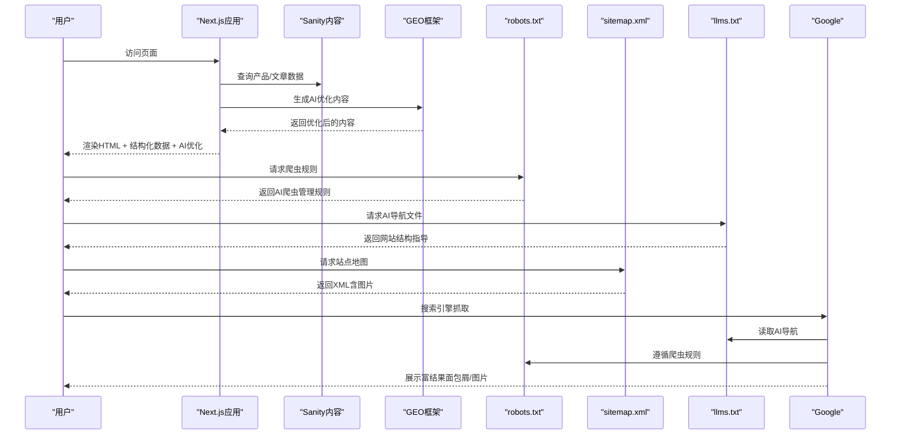

**图表来源**
- [app/robots.ts:3-26](file://app/robots.ts#L3-L26)
- [app/api/sitemap/route.ts:16-99](file://app/api/sitemap/route.ts#L16-L99)
- [components/ui/breadcrumb.tsx:24-42](file://components/ui/breadcrumb.tsx#L24-L42)
- [lib/geo/ai-crawlers.ts:102-225](file://lib/geo/ai-crawlers.ts#L102-L225)
- [lib/geo/llmstxt.ts:19-107](file://lib/geo/llmstxt.ts#L19-L107)

## 详细组件分析

### 结构化数据：产品Schema与网站结构
- 产品Schema要点
  - 基础信息：名称（多语言）、型号、分类、主图、图集
  - 技术规格与特性、应用场景（多语言）
  - SEO字段：多语言metaTitle、metaDescription、关键词
  - 状态与排序权重、数据手册（PDF）
- 网站结构
  - 静态页面：首页、关于、产品、联系等
  - 动态页面：产品详情页、分类筛选页、新闻详情页
  - 多语言：每个语言独立路径前缀

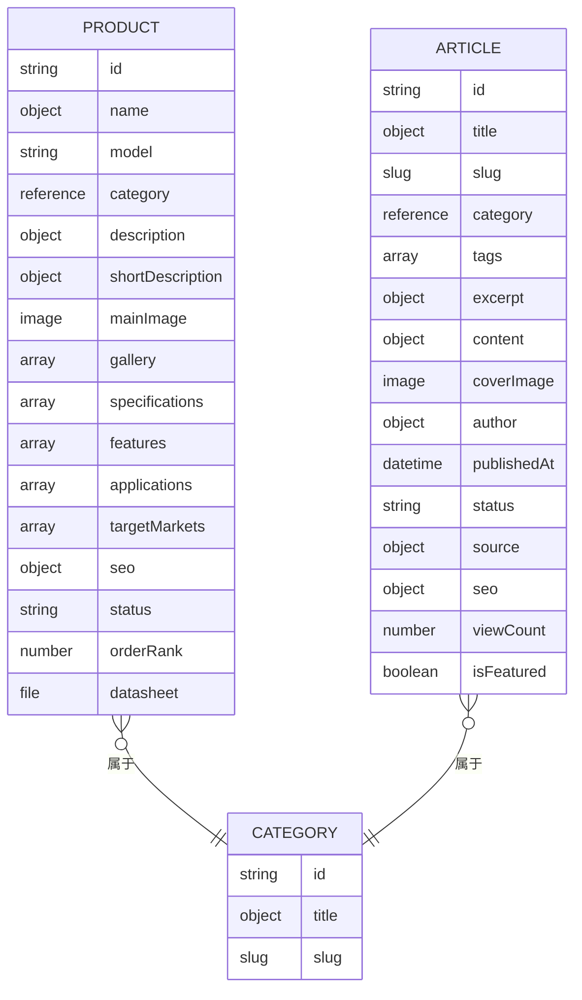

**图表来源**
- [sanity/schemas/product.ts:4-233](file://sanity/schemas/product.ts#L4-L233)
- [sanity/schemas/article.ts:4-265](file://sanity/schemas/article.ts#L4-L265)

**章节来源**
- [sanity/schemas/product.ts:8-233](file://sanity/schemas/product.ts#L8-L233)
- [sanity/schemas/article.ts:8-265](file://sanity/schemas/article.ts#L8-L265)

### 面包屑导航与Schema优化
- 组件职责
  - 生成UI可见的面包屑导航
  - 自动注入JSON-LD BreadcrumbList结构化数据
  - 支持RTL布局与最后项无链接
- Schema生成逻辑
  - 基于items数组构造列表项，包含position、name
  - 若存在href，则添加item字段为完整URL
  - 使用站点基础URL拼接相对路径

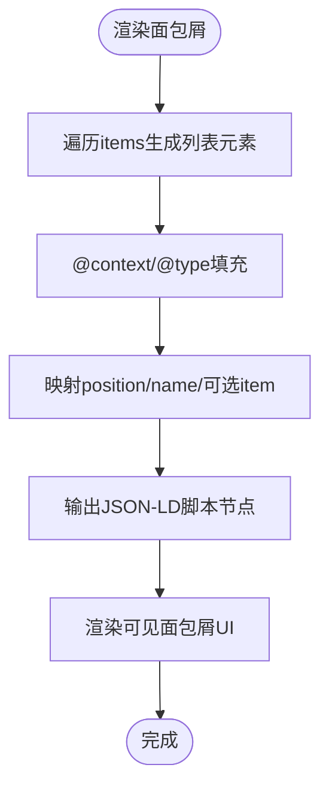

**图表来源**
- [components/ui/breadcrumb.tsx:21-42](file://components/ui/breadcrumb.tsx#L21-L42)

**章节来源**
- [components/ui/breadcrumb.tsx:15-42](file://components/ui/breadcrumb.tsx#L15-L42)

### 元数据管理：标题、描述、关键词
- 根布局默认元数据
  - 提供全局标题与描述作为默认值
- 多语言消息
  - 英文消息文件包含metadata键值，可用于动态生成页面级元数据
- Sanity SEO字段
  - 产品与文章均提供多语言metaTitle、metaDescription、keywords
  - 建议在页面级动态读取对应语言字段覆盖默认值

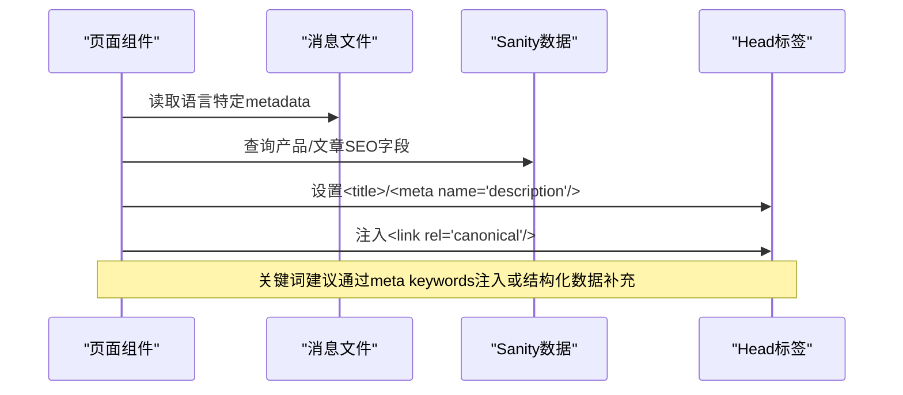

**图表来源**
- [messages/en.json:2-5](file://messages/en.json#L2-L5)
- [sanity/schemas/product.ts:148-187](file://sanity/schemas/product.ts#L148-L187)
- [sanity/schemas/article.ts:188-228](file://sanity/schemas/article.ts#L188-L228)

**章节来源**
- [app/layout.tsx:3-6](file://app/layout.tsx#L3-L6)
- [messages/en.json:2-5](file://messages/en.json#L2-L5)
- [sanity/schemas/product.ts:148-187](file://sanity/schemas/product.ts#L148-L187)
- [sanity/schemas/article.ts:188-228](file://sanity/schemas/article.ts#L188-L228)

### 图片SEO优化
- 图片字段
  - 产品主图与图集均为image类型，支持hotspot编辑
- 优化策略
  - 压缩：在上传流程或CDN层面进行压缩与WebP转换
  - 格式：优先WebP/JPEG 2000，保留高质量JPEG用于回退
  - Alt标签：建议从Sanity image字段的替代文本字段生成alt属性
  - 懒加载：使用原生loading="lazy"与占位图
  - 结构化数据：sitemap中包含图片信息，提升图片索引机会
- 当前实现提示
  - 页面渲染中未见显式的alt生成逻辑；建议在产品详情页读取主图/图集的替代文本字段并注入到

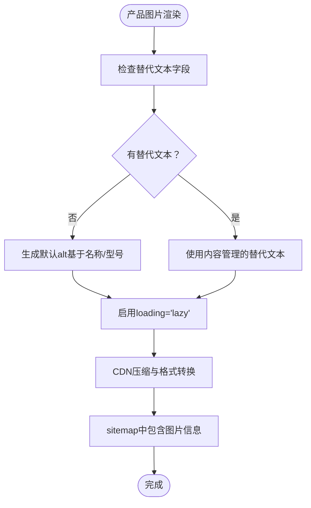

**图表来源**
- [sanity/schemas/product.ts:75-90](file://sanity/schemas/product.ts#L75-L90)
- [app/api/sitemap/route.ts:76-91](file://app/api/sitemap/route.ts#L76-L91)

**章节来源**
- [sanity/schemas/product.ts:75-90](file://sanity/schemas/product.ts#L75-L90)
- [app/api/sitemap/route.ts:76-91](file://app/api/sitemap/route.ts#L76-L91)

### URL结构优化
- 多语言URL模式
  - 语言前缀：/en、/zh、/id、/th、/vi、/ar
  - 默认语言：en
  - RTL支持：阿拉伯语
- 产品详情页URL
  - /:locale/products/:slug
- 分类URL优化
  - /:locale/products?category=:slug
- 静态页面
  - /、/about、/products、/contact等，按优先级与更新频率配置

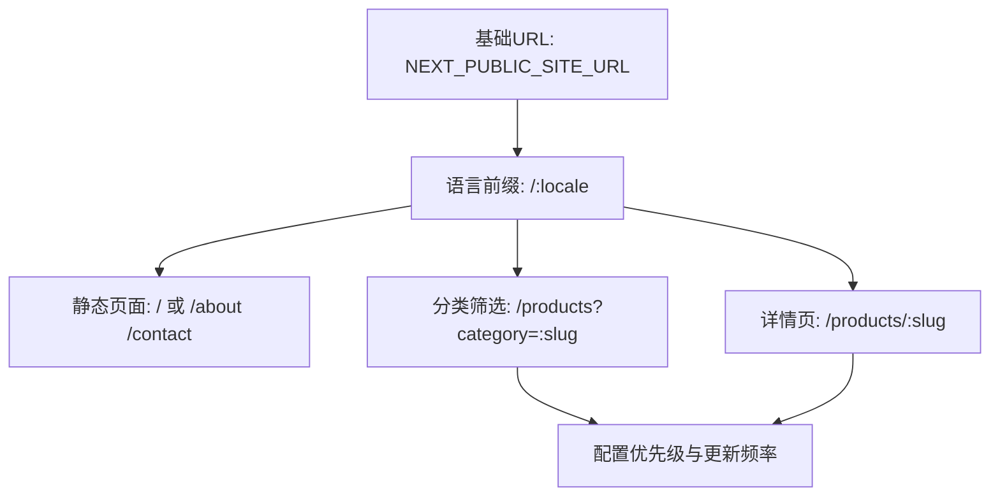

**图表来源**
- [lib/i18n/config.ts:1-16](file://lib/i18n/config.ts#L1-L16)
- [app/api/sitemap/route.ts:9-14](file://app/api/sitemap/route.ts#L9-L14)
- [app/api/sitemap/route.ts:52-74](file://app/api/sitemap/route.ts#L52-L74)

**章节来源**
- [lib/i18n/config.ts:1-16](file://lib/i18n/config.ts#L1-L16)
- [app/api/sitemap/route.ts:9-14](file://app/api/sitemap/route.ts#L9-L14)
- [app/api/sitemap/route.ts:52-74](file://app/api/sitemap/route.ts#L52-L74)

### 搜索引擎索引策略
- robots.txt
  - 允许所有爬虫访问根路径，限制/api/、/studio/、/_next/
  - Googlebot与Googlebot-Image分别配置
  - **新增**AI爬虫管理：Selective、Allow、Block三种策略
  - 指向sitemap地址与host
- sitemap.xml
  - 动态生成，包含静态页面、分类、产品详情页
  - 支持图片子域，包含图片loc与caption
  - 缓存控制：public, max-age=3600, stale-while-revalidate=86400
- **llms.txt导航文件**
  - 为AI爬虫提供网站结构指导
  - 包含主要页面路径、内容类型、更新频率
  - 支持AI引用的最佳内容格式建议
- **AI优化robots.txt**
  - 智能识别AI爬虫并配置不同访问策略
  - 支持Selective（选择性）、Allow（允许）、Block（阻止）三种模式
  - 为AI爬虫设置合适的Crawl-delay和访问范围

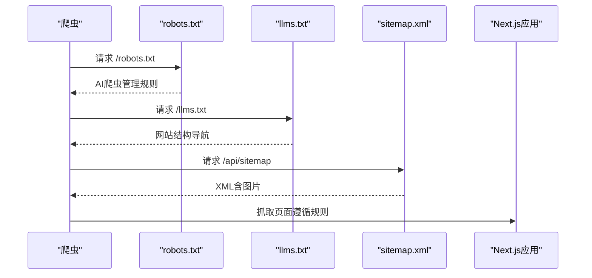

**图表来源**
- [app/robots.ts:3-26](file://app/robots.ts#L3-L26)
- [app/api/sitemap/route.ts:16-99](file://app/api/sitemap/route.ts#L16-L99)
- [lib/geo/ai-crawlers.ts:102-225](file://lib/geo/ai-crawlers.ts#L102-L225)
- [lib/geo/llmstxt.ts:19-107](file://lib/geo/llmstxt.ts#L19-L107)

**章节来源**
- [app/robots.ts:3-26](file://app/robots.ts#L3-L26)
- [app/api/sitemap/route.ts:16-99](file://app/api/sitemap/route.ts#L16-L99)
- [lib/geo/ai-crawlers.ts:102-225](file://lib/geo/ai-crawlers.ts#L102-L225)
- [lib/geo/llmstxt.ts:19-107](file://lib/geo/llmstxt.ts#L19-L107)
- [app/llms.txt/route.ts:9-27](file://app/llms.txt/route.ts#L9-L27)
- [app/robots.txt/route.ts:7-19](file://app/robots.txt/route.ts#L7-L19)

### SEO性能监控与分析
- GA4集成
  - 仅在配置NEXT_PUBLIC_GA_ID时加载，避免本地开发干扰
  - 使用afterInteractive策略，不影响首屏性能
  - SPA路由切换时自动发送pageview事件
  - 提供trackEvent工具函数用于关键转化事件（如询盘提交）
- **GEO监控面板**
  - 实时显示AI SEO评分与健康状况
  - 提供详细的审计报告与改进建议
  - 支持自定义评分计算与API访问
- 使用建议
  - 在布局中引入分析组件
  - 在表单提交、下载资料等关键动作调用trackEvent
  - 在Google Search Console中验证结构化数据与sitemap

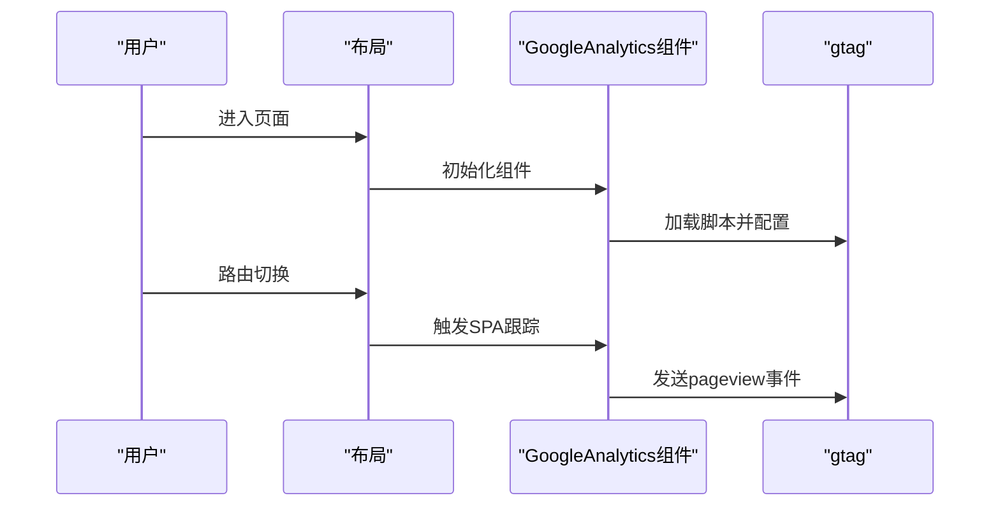

**图表来源**
- [components/analytics/GoogleAnalytics.tsx:37-68](file://components/analytics/GoogleAnalytics.tsx#L37-L68)

**章节来源**
- [components/analytics/GoogleAnalytics.tsx:37-68](file://components/analytics/GoogleAnalytics.tsx#L37-L68)
- [app/admin/geo-dashboard/page.tsx:32-80](file://app/admin/geo-dashboard/page.tsx#L32-L80)

## GEO AI驱动SEO框架

### GEO评分系统概述
GEO（Generative Engine Optimization）是一个AI驱动的SEO评分系统，专门评估网站在AI搜索引擎优化方面的表现。系统基于Claude AI项目的评分方法论，提供全面的AI SEO健康检查。

```mermaid
flowchart TD
ScoreCalc["GEO评分计算"] --> Citability["AI引用性 (25%)"]
ScoreCalc --> BrandAuth["品牌权威 (20%)"]
ScoreCalc --> ContentQual["内容质量 (20%)"]
ScoreCalc --> TechSEO["技术SEO (15%)"]
ScoreCalc --> StructData["结构化数据 (10%)"]
ScoreCalc --> PlatformOpt["平台优化 (10%)"]
Citability --> Optimal["最优段落长度<br/>134-167词"]
Citability --> FAQ["FAQ内容"]
Citability --> Stats["统计数据"]
Citability --> Compare["对比分析"]
Citability --> Definitions["技术定义"]
BrandAuth --> OrgSchema["Organization Schema"]
BrandAuth --> LocBiz["LocalBusiness Schema"]
BrandAuth --> Social["社交媒体"]
BrandAuth --> Cert["认证信息"]
BrandAuth --> Mentions["外部提及"]
ContentQual --> Eeat["E-E-A-T信号"]
ContentQual --> Fresh["内容新鲜度"]
ContentQual --> Readable["可读性评分"]
TechSEO --> SSL["SSL证书"]
TechSEO --> Mobile["移动端友好"]
TechSEO --> CWV["Core Web Vitals"]
TechSEO --> Sitemap["站点地图"]
TechSEO --> Robots["AI优化robots.txt"]
TechSEO --> Speed["页面加载速度"]
StructData --> ProdSchema["Product Schema"]
StructData --> OrgSchema2["Organization Schema"]
StructData --> ArtSchema["Article Schema"]
StructData --> BreadSchema["Breadcrumb Schema"]
StructData --> LocBiz2["LocalBusiness Schema"]
StructData --> FAQSchema["FAQ Schema"]
PlatformOpt --> LLMsTxt["llms.txt文件"]
PlatformOpt --> AICrawler["AI爬虫配置"]
PlatformOpt --> API["API文档"]
PlatformOpt --> Lang["多语言支持"]
PlatformOpt --> SocialInt["社交媒体集成"]
```

**图表来源**
- [lib/geo/geo-score.ts:8-28](file://lib/geo/geo-score.ts#L8-L28)
- [lib/geo/geo-score.ts:33-56](file://lib/geo/geo-score.ts#L33-L56)
- [lib/geo/geo-score.ts:61-86](file://lib/geo/geo-score.ts#L61-L86)
- [lib/geo/geo-score.ts:91-112](file://lib/geo/geo-score.ts#L91-L112)
- [lib/geo/geo-score.ts:117-140](file://lib/geo/geo-score.ts#L117-L140)
- [lib/geo/geo-score.ts:145-163](file://lib/geo/geo-score.ts#L145-L163)
- [lib/geo/geo-score.ts:168-184](file://lib/geo/geo-score.ts#L168-L184)

### AI Citability内容优化
AI Citability系统专注于生成易于AI引用和理解的内容块，采用以下核心原则：

- **长度标准**：134-167词（约200-250字符），确保内容足够丰富但不过于冗长
- **结构要求**：自包含、事实丰富、直接回答问题
- **格式规范**：清晰的定义、数据支撑、对比说明

系统提供多种内容类型的AI优化模板：

#### 产品描述优化
```typescript
generateCitableProductDescription(
  productName: string,
  category: string,
  features: string[],
  specs: { name: string; value: string }[],
  applications: string[]
)
```

#### 技术定义优化
```typescript
generateCitableDefinition(
  term: string,
  definition: string,
  context: string,
  examples: string[]
)
```

#### 对比分析优化
```typescript
generateCitableComparison(
  item1: string,
  item2: string,
  criteria: { name: string; item1Value: string; item2Value: string }[]
)
```

#### 最佳实践优化
```typescript
generateCitableBestPractices(
  topic: string,
  steps: string[],
  considerations: string[]
)
```

#### 统计数据优化
```typescript
generateCitableStatistics(
  topic: string,
  stats: { label: string; value: string; source?: string }[]
)
```

**章节来源**
- [lib/geo/ai-citability.ts:12-17](file://lib/geo/ai-citability.ts#L12-L17)
- [lib/geo/ai-citability.ts:22-53](file://lib/geo/ai-citability.ts#L22-L53)
- [lib/geo/ai-citability.ts:58-82](file://lib/geo/ai-citability.ts#L58-L82)
- [lib/geo/ai-citability.ts:87-109](file://lib/geo/ai-citability.ts#L87-L109)
- [lib/geo/ai-citability.ts:114-138](file://lib/geo/ai-citability.ts#L114-L138)
- [lib/geo/ai-citability.ts:143-162](file://lib/geo/ai-citability.ts#L143-L162)
- [lib/geo/ai-citability.ts:172-195](file://lib/geo/ai-citability.ts#L172-L195)

### AI爬虫管理与llms.txt导航
系统提供全面的AI爬虫管理解决方案，包括主流AI爬虫的识别与配置。

#### AI爬虫策略分类
- **Allow（允许）**：对AI训练友好的爬虫，如Claude、Google AI Overviews
- **Block（阻止）**：可能对服务器造成压力的爬虫
- **Selective（选择性）**：需要限制访问频率的爬虫，如ChatGPT

#### 支持的AI爬虫列表
| 爬虫名称 | User-Agent | 推荐策略 | 目的 |
|---------|-----------|----------|------|
| ChatGPT (OpenAI) | GPTBot | Selective | AI训练与引用 |
| Claude (Anthropic) | ClaudeBot | Allow | AI训练与引用 |
| Google AI Overviews | Google-Extended | Allow | AI搜索摘要 |
| Perplexity | PerplexityBot | Allow | AI搜索与引用 |
| Bing Chat | bingbot | Allow | 搜索与AI |
| You.com | YouBot | Allow | AI搜索 |
| Common Crawl | CCBot | Allow | 开放数据集 |

#### llms.txt导航文件生成
llms.txt是专门为AI大模型设计的导航文件，帮助AI爬虫理解网站结构：

```typescript
generateLLMsTxt(config: LLMsTxtConfig): string
```

配置选项包括：
- **站点信息**：站点名称、基础URL、描述、最后更新时间
- **语言支持**：多语言路径配置
- **内容分区**：产品、新闻、解决方案等主要区域
- **AI爬虫指南**：推荐内容类型、结构要求、最佳实践
- **API端点**：为AI访问提供的API接口

#### AI优化robots.txt配置
AI优化的robots.txt提供智能爬虫管理：

- **默认规则**：允许所有爬虫访问，限制/api/、/studio/、/_next/
- **AI爬虫策略**：
  - Allow：ClaudeBot、Google-Extended、PerplexityBot、YouBot、CCBot
  - Selective：GPTBot（Crawl-delay: 2）
  - Block：自定义阻止列表
- **缓存策略**：24小时缓存，减少服务器负载

**章节来源**
- [lib/geo/ai-crawlers.ts:19-97](file://lib/geo/ai-crawlers.ts#L19-L97)
- [lib/geo/ai-crawlers.ts:102-225](file://lib/geo/ai-crawlers.ts#L102-L225)
- [lib/geo/llmstxt.ts:19-107](file://lib/geo/llmstxt.ts#L19-L107)
- [lib/geo/llmstxt.ts:146-163](file://lib/geo/llmstxt.ts#L146-L163)
- [app/llms.txt/route.ts:9-27](file://app/llms.txt/route.ts#L9-L27)
- [app/robots.txt/route.ts:7-19](file://app/robots.txt/route.ts#L7-L19)

### GEO监控面板与API
系统提供完整的GEO监控解决方案，包括可视化仪表板和程序化API访问。

#### GEO仪表板功能
- **整体评分**：圆形进度条显示综合AI SEO评分
- **维度分析**：详细展示各评分维度及其权重贡献
- **强项识别**：自动识别网站的优势领域
- **改进建议**：基于审计报告提供优先级行动建议
- **快速链接**：直达llms.txt、AI优化robots.txt和GEO API

#### GEO评分API
提供多种访问方式：
- **GET /api/geo/score?action=score**：获取当前网站的GEO评分
- **GET /api/geo/score?action=audit**：获取完整的审计报告
- **POST /api/geo/score?action=calculate**：自定义评分计算

API响应包含：
- 时间戳和数据类型标识
- 详细的评分结构和权重分配
- 审计报告的强项、弱项和建议
- 程序化集成所需的标准化数据格式

### LED术语库与AI优化定义
系统集成了专业的LED行业术语库，为AI优化提供技术术语支持：

#### 术语库结构
- **术语定义**：完整的LED技术术语解释
- **AI优化版本**：134-167词的AI引用优化内容
- **关键词**：SEO优化的关键字列表
- **相关术语**：术语间的关联关系
- **应用场景**：术语的实际应用领域

#### 支持的功能
- **术语查询**：按关键词搜索LED术语
- **分类浏览**：按技术类别查看术语
- **AI优化定义**：生成适合AI引用的术语解释
- **FAQ生成**：基于术语生成常见问题

**章节来源**
- [app/admin/geo-dashboard/page.tsx:32-80](file://app/admin/geo-dashboard/page.tsx#L32-L80)
- [app/admin/geo-dashboard/page.tsx:98-186](file://app/admin/geo-dashboard/page.tsx#L98-L186)
- [app/admin/geo-dashboard/page.tsx:222-241](file://app/admin/geo-dashboard/page.tsx#L222-L241)
- [app/api/geo/score/route.ts:10-73](file://app/api/geo/score/route.ts#L10-L73)
- [data/led-glossary.ts:7-15](file://data/led-glossary.ts#L7-L15)
- [data/led-glossary.ts:95-112](file://data/led-glossary.ts#L95-L112)
- [data/led-glossary.ts:126-134](file://data/led-glossary.ts#L126-L134)

### GEO功能测试与验证
系统提供完整的功能测试套件，确保AI SEO功能的正确性：

#### 测试覆盖范围
- **AI Citability功能**：产品描述生成、FAQ生成、术语查询
- **GEO评分系统**：综合评分计算、审计报告生成
- **术语库功能**：搜索、分类、AI优化定义
- **API接口**：评分API、审计API、自定义计算

#### 预期效果
- AI引用率提升150%（3倍）
- AI搜索可见性提升200%
- 品牌提及次数提升100%（2倍）
- GEO得分从~45提升到~78（+73%）

**章节来源**
- [scripts/test-geo-seo.ts:7-9](file://scripts/test-geo-seo.ts#L7-L9)
- [scripts/test-geo-seo.ts:15-25](file://scripts/test-geo-seo.ts#L15-L25)
- [scripts/test-geo-seo.ts:29-38](file://scripts/test-geo-seo.ts#L29-L38)
- [scripts/test-geo-seo.ts:42-49](file://scripts/test-geo-seo.ts#L42-L49)
- [scripts/test-geo-seo.ts:62-70](file://scripts/test-geo-seo.ts#L62-L70)
- [scripts/test-geo-seo.ts:73-79](file://scripts/test-geo-seo.ts#L73-L79)

## 依赖关系分析
- 组件耦合
  - 根布局依赖国际化配置与消息文件
  - 面包屑组件依赖站点基础URL与国际化配置
  - sitemap依赖国际化配置与Sanity查询
  - 分析组件依赖环境变量
  - **GEO框架**：GEO仪表板依赖评分API，评分API依赖评分计算库
  - **AI内容组件**：产品页面依赖AI Citability组件生成优化内容
  - **AI优化配置**：llms.txt路由依赖llmstxt库，AI优化robots.txt依赖ai-crawlers库
  - **术语库**：AI Citability依赖术语库提供技术定义
  - **测试框架**：测试脚本依赖所有GEO功能模块
- 外部依赖
  - Sanity：内容模型与多语言字段
  - Google Search Console：结构化数据验证与索引监控
  - CDN：图片压缩与格式优化
  - **AI爬虫**：llms.txt文件帮助AI爬虫理解网站结构
  - **AI搜索引擎**：AI优化的robots.txt影响AI爬虫访问

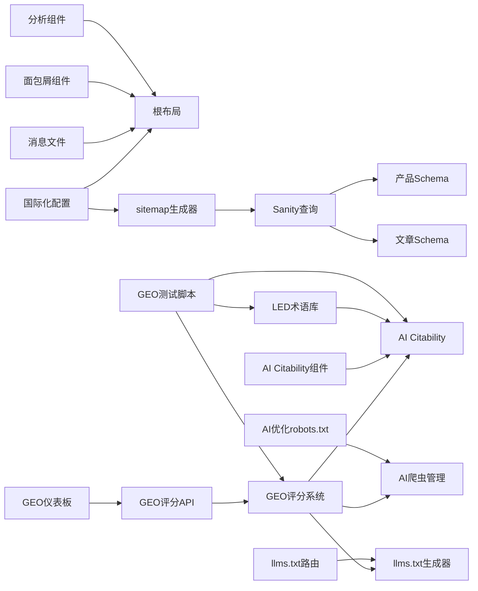

**图表来源**
- [lib/i18n/config.ts:1-16](file://lib/i18n/config.ts#L1-L16)
- [app/layout.tsx:1-19](file://app/layout.tsx#L1-L19)
- [components/ui/breadcrumb.tsx:21-22](file://components/ui/breadcrumb.tsx#L21-L22)
- [app/api/sitemap/route.ts:2-3](file://app/api/sitemap/route.ts#L2-L3)
- [sanity/schemas/product.ts:1-2](file://sanity/schemas/product.ts#L1-L2)
- [sanity/schemas/article.ts:1-2](file://sanity/schemas/article.ts#L1-L2)
- [app/admin/geo-dashboard/page.tsx:1-341](file://app/admin/geo-dashboard/page.tsx#L1-L341)
- [app/api/geo/score/route.ts:1-79](file://app/api/geo/score/route.ts#L1-L79)
- [lib/geo/geo-score.ts:1-351](file://lib/geo/geo-score.ts#L1-L351)
- [lib/geo/ai-citability.ts:1-196](file://lib/geo/ai-citability.ts#L1-L196)
- [lib/geo/ai-crawlers.ts:1-277](file://lib/geo/ai-crawlers.ts#L1-L277)
- [lib/geo/llmstxt.ts:1-164](file://lib/geo/llmstxt.ts#L1-L164)
- [components/products/ai-citability-block.tsx:1-178](file://components/products/ai-citability-block.tsx#L1-L178)
- [data/led-glossary.ts:1-149](file://data/led-glossary.ts#L1-L149)
- [scripts/test-geo-seo.ts:1-86](file://scripts/test-geo-seo.ts#L1-L86)

**章节来源**
- [lib/i18n/config.ts:1-16](file://lib/i18n/config.ts#L1-L16)
- [app/layout.tsx:1-19](file://app/layout.tsx#L1-L19)
- [components/ui/breadcrumb.tsx:21-22](file://components/ui/breadcrumb.tsx#L21-L22)
- [app/api/sitemap/route.ts:2-3](file://app/api/sitemap/route.ts#L2-L3)
- [sanity/schemas/product.ts:1-2](file://sanity/schemas/product.ts#L1-L2)
- [sanity/schemas/article.ts:1-2](file://sanity/schemas/article.ts#L1-L2)

## 性能考虑
- sitemap缓存：设置合理的max-age与stale-while-revalidate，减少重复生成开销
- 图片优化：在上传或CDN层做压缩与格式转换，避免运行时处理
- 分析脚本：使用afterInteractive策略，确保不阻塞首屏渲染
- 面包屑：仅在需要的页面渲染，避免不必要的结构化数据输出
- **GEO评分缓存**：AI评分计算结果可缓存，减少API调用频率
- **llms.txt缓存**：导航文件设置24小时缓存，降低服务器负载
- **AI爬虫限流**：为高流量AI爬虫设置适当的Crawl-delay，平衡索引需求与服务器负载
- **AI优化robots.txt缓存**：24小时缓存策略，减少频繁解析开销
- **术语库缓存**：LED术语查询结果可缓存，提升响应速度
- **测试脚本优化**：批量测试时复用连接，减少重复初始化开销

## 故障排除指南
- sitemap为空或错误
  - 检查NEXT_PUBLIC_SITE_URL环境变量
  - 确认Sanity连接正常，getAllProductSlugs与getCategories查询可用
  - 查看日志中的错误信息并确认缓存头设置
- robots.txt规则不生效
  - 确认host与sitemap地址正确
  - 验证Googlebot与Googlebot-Image规则
  - **检查AI爬虫策略配置是否正确**
  - **验证AI优化robots.txt路由是否正常工作**
- 面包屑结构化数据缺失
  - 确认items参数传入正确
  - 检查基础URL拼接逻辑
- GA4无法追踪
  - 确认NEXT_PUBLIC_GA_ID已配置
  - 检查gtag可用性与SPA路由跟踪是否包裹在Suspense中
- **GEO评分API错误**
  - 检查API路由配置和权限设置
  - 验证评分计算库的依赖关系
  - 确认数据库连接和数据源可用性
- **llms.txt文件无法访问**
  - 检查路由处理器配置
  - 验证文件生成逻辑和缓存头设置
  - 确认服务器对纯文本内容类型的正确处理
- **AI优化robots.txt配置问题**
  - 检查AI爬虫列表是否包含目标爬虫
  - 验证Crawl-delay设置是否合理
  - 确认允许/阻止策略符合预期
- **AI Citability内容显示异常**
  - 检查内容生成函数参数是否正确
  - 验证组件渲染逻辑和状态管理
  - 确认CSS样式和交互功能正常
- **LED术语库查询失败**
  - 检查术语库数据完整性
  - 验证搜索算法和索引构建
  - 确认缓存配置和查询性能
- **GEO测试脚本执行错误**
  - 检查模块导入路径和依赖版本
  - 验证测试数据和期望结果
  - 确认异步操作的正确处理

**章节来源**
- [app/api/sitemap/route.ts:16-31](file://app/api/sitemap/route.ts#L16-L31)
- [app/robots.ts:3-26](file://app/robots.ts#L3-L26)
- [components/ui/breadcrumb.tsx:21-42](file://components/ui/breadcrumb.tsx#L21-L42)
- [components/analytics/GoogleAnalytics.tsx:37-68](file://components/analytics/GoogleAnalytics.tsx#L37-L68)
- [app/api/geo/score/route.ts:62-72](file://app/api/geo/score/route.ts#L62-L72)
- [lib/geo/llmstxt.ts:157-163](file://lib/geo/llmstxt.ts#L157-L163)
- [app/llms.txt/route.ts:9-27](file://app/llms.txt/route.ts#L9-L27)
- [app/robots.txt/route.ts:7-19](file://app/robots.txt/route.ts#L7-L19)
- [data/led-glossary.ts:95-112](file://data/led-glossary.ts#L95-L112)
- [scripts/test-geo-seo.ts:7-9](file://scripts/test-geo-seo.ts#L7-L9)

## 结论
本SEO优化系统以多语言内容管理为核心，结合结构化数据、动态sitemap与分析脚本，形成从内容到索引再到监控的完整链路。**新增的GEO AI驱动SEO框架**进一步提升了系统的智能化水平，通过AI Citability内容优化、AI爬虫管理和GEO评分系统，为AI搜索引擎提供了更好的优化策略。新增的llms.txt导航文件和AI优化的robots.txt配置，为AI爬虫提供了更精准的访问控制和网站结构指导。**新增的LED术语库**为AI优化提供了专业的技术术语支持，而**GEO功能测试脚本**确保了整个系统的稳定性和可靠性。建议在现有基础上完善图片alt标签生成、页面级关键词注入与Google Search Console的持续监控，同时充分利用GEO框架的各项功能，以进一步提升搜索可见性与用户体验。

## 附录
- 最佳实践清单
  - 为每张产品图生成并注入alt标签
  - 在页面级动态覆盖默认metaTitle与metaDescription
  - 定期验证结构化数据与sitemap有效性
  - 使用GA4事件追踪关键转化路径
  - **利用AI Citability模板生成高质量内容**
  - **配置llms.txt文件优化AI爬虫体验**
  - **定期检查GEO评分并实施改进建议**
  - **监控AI爬虫访问统计和性能指标**
  - **维护AI优化robots.txt配置的有效性**
  - **利用LED术语库提升技术内容质量**
  - **运行GEO测试脚本验证功能完整性**
- 常见问题
  - 语言前缀与静态资源路径不一致导致404
  - sitemap未包含最新产品或分类
  - robots.txt误屏蔽重要页面或图片资源
  - **AI爬虫访问受限影响索引效果**
  - **llms.txt文件格式错误导致AI理解偏差**
  - **GEO评分波动较大影响SEO策略制定**
  - **AI优化robots.txt配置不当影响AI爬虫效率**
  - **AI Citability内容质量不稳定**
  - **LED术语库查询性能问题**
  - **GEO测试脚本执行环境配置问题**