# Sanity内容管理系统

<cite>
**本文档引用的文件**
- [sanity.config.ts](file://sanity/sanity.config.ts)
- [sanity.cli.ts](file://sanity/sanity.cli.ts)
- [package.json](file://sanity/package.json)
- [index.ts](file://sanity/schemas/index.ts)
- [product.ts](file://sanity/schemas/product.ts)
- [product.plumbing.ts](file://sanity/schemas/product.plumbing.ts)
- [product.generic.ts](file://sanity/schemas/product.generic.ts)
- [category.ts](file://sanity/schemas/category.ts)
- [article.ts](file://sanity/schemas/article.ts)
- [articleCategory.ts](file://sanity/schemas/articleCategory.ts)
- [inquiry.ts](file://sanity/schemas/inquiry.ts)
- [productSpec.ts](file://sanity/schemas/productSpec.ts)
- [client.ts](file://lib/sanity/client.ts)
- [import-products.ts](file://scripts/import-products.ts)
- [seed-categories.ts](file://scripts/seed-categories.ts)
- [setup-plumbing.js](file://scripts/setup-plumbing.js)
- [setup-industry.js](file://scripts/setup-industry.js)
- [industry.plumbing.ts](file://lib/config/industry.plumbing.ts)
- [industry.ts](file://lib/config/industry.ts)
- [README.md](file://README.md)
</cite>

## 更新摘要
**所做更改**
- 新增水暖卫浴专用产品模型（product.plumbing）
- 新增通用产品模型（product.generic）
- 新增水暖卫浴行业配置和初始化脚本
- 更新产品模型对比分析
- 新增行业模板和多行业支持功能
- 增强产品规格参数管理功能

## 目录
1. [简介](#简介)
2. [项目结构](#项目结构)
3. [核心组件](#核心组件)
4. [架构概览](#架构概览)
5. [详细组件分析](#详细组件分析)
6. [产品模型对比分析](#产品模型对比分析)
7. [行业模板系统](#行业模板系统)
8. [依赖关系分析](#依赖关系分析)
9. [性能考虑](#性能考虑)
10. [故障排除指南](#故障排除指南)
11. [结论](#结论)
12. [附录](#附录)

## 简介

GoPro Trade网站的Sanity CMS是一个基于内容管理系统的现代化内容平台，专门为LED和光电产品贸易公司设计。该系统采用Next.js前端框架与Sanity Headless CMS相结合的架构，提供了强大的内容创作、管理和发布功能。

**新增功能**：
- **多行业支持**：支持LED光电、水暖卫浴、制造业、服务业等多种行业模板
- **专用产品模型**：针对不同行业提供专门优化的产品管理方案
- **灵活配置系统**：通过行业预设快速切换不同的业务模式
- **增强的水暖卫浴功能**：专门针对卫浴设备行业的特性优化
- **产品规格参数增强**：支持更详细的技术规格和认证跟踪

系统的核心特点包括：
- 多语言支持（中、英、印尼语、泰语、越南语、阿拉伯语）
- 结构化的文档模型设计
- 可视化内容编辑器
- 高级SEO功能
- 批量数据导入和管理工具
- 完整的版本控制和发布流程
- **行业特定的配置和优化**

## 项目结构

该项目采用前后端分离的架构设计，Sanity CMS作为独立的内容管理后台运行在3333端口，前端Next.js应用运行在3000端口。

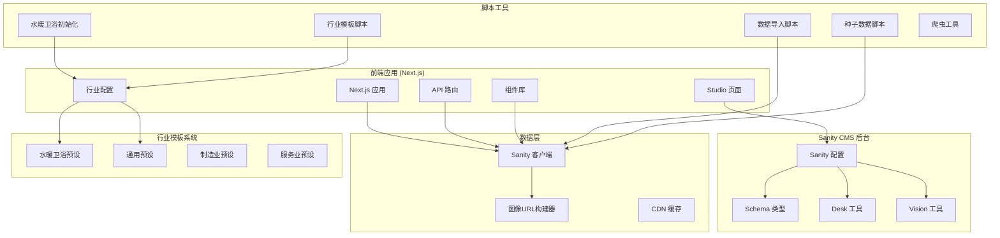

**图表来源**
- [sanity.config.ts:1-33](file://sanity/sanity.config.ts#L1-L33)
- [sanity/package.json:1-16](file://sanity/package.json#L1-L16)
- [client.ts:1-30](file://lib/sanity/client.ts#L1-L30)
- [setup-plumbing.js:1-100](file://scripts/setup-plumbing.js#L1-L100)
- [industry.ts:1-65](file://lib/config/industry.ts#L1-L65)

**章节来源**
- [sanity.config.ts:1-33](file://sanity/sanity.config.ts#L1-L33)
- [sanity/package.json:1-16](file://sanity/package.json#L1-L16)
- [README.md:1-42](file://README.md#L1-L42)

## 核心组件

### Sanity Studio 配置

Sanity Studio是整个内容管理系统的核心，负责提供可视化的内容编辑界面和管理工具。

**主要配置特性：**
- **项目标识符管理**：支持通过环境变量或硬编码方式配置项目ID和数据集
- **插件集成**：集成Desk工具用于文档管理，Vision工具用于查询调试
- **国际化支持**：支持中英文界面切换
- **Schema类型注册**：自动加载所有定义的Schema类型

**章节来源**
- [sanity.config.ts:7-32](file://sanity/sanity.config.ts#L7-L32)

### 数据模型架构

系统采用模块化的Schema设计，每个核心实体都有独立的Schema文件：

**核心数据模型：**
- **Product**：产品文档，包含多语言信息、规格参数、媒体资源
- **Product (Plumbing)**：水暖卫浴专用产品模型，支持卫浴行业特性
- **Product (Generic)**：通用产品模型，适用于各种行业基础需求
- **Category**：产品分类，支持层级结构和图标
- **Article**：资讯文章，支持富文本编辑和SEO优化
- **Inquiry**：客户询单，跟踪销售线索状态
- **ProductSpec**：产品规格参数，支持分类关联
- **ArticleCategory**：文章分类，组织资讯内容

**新增产品模型特点：**
- **水暖卫浴模型**：专为卫浴设备设计，包含认证、应用领域等专业字段
- **通用模型**：简化版本，适合基础产品管理需求
- **兼容性设计**：与现有系统完全兼容，可无缝切换

**章节来源**
- [index.ts:1-9](file://sanity/schemas/index.ts#L1-L9)
- [product.ts:1-233](file://sanity/schemas/product.ts#L1-L233)
- [product.plumbing.ts:1-261](file://sanity/schemas/product.plumbing.ts#L1-L261)
- [product.generic.ts:1-106](file://sanity/schemas/product.generic.ts#L1-L106)
- [category.ts:1-74](file://sanity/schemas/category.ts#L1-L74)

## 架构概览

系统采用Headless CMS架构，前端应用通过API与Sanity进行数据交互。

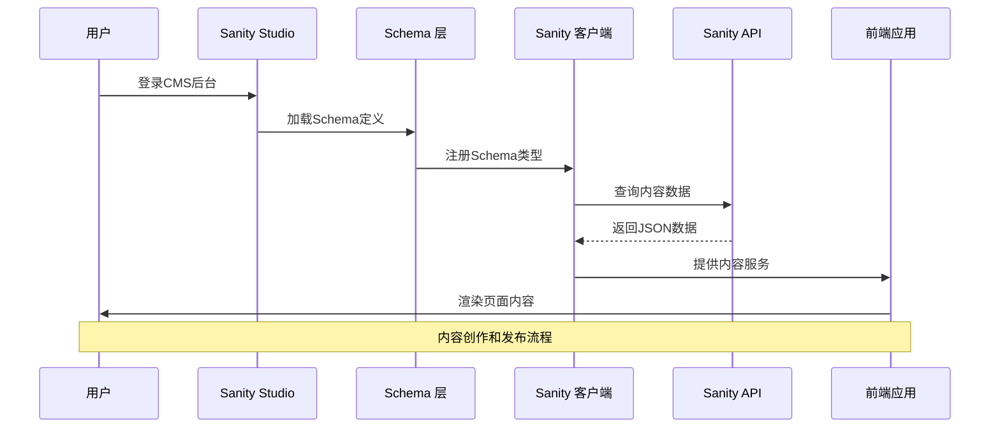

**图表来源**
- [sanity.config.ts:18-25](file://sanity/sanity.config.ts#L18-L25)
- [client.ts:9-15](file://lib/sanity/client.ts#L9-L15)

### 数据流架构

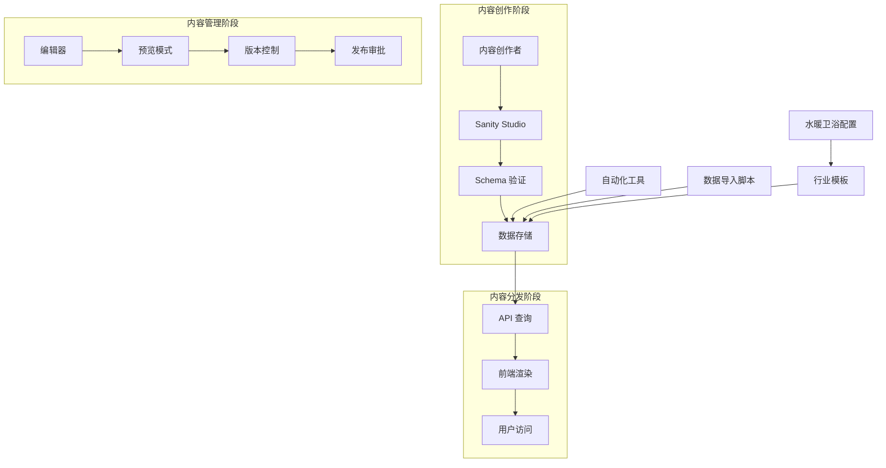

**图表来源**
- [product.ts:149-187](file://sanity/schemas/product.ts#L149-L187)
- [article.ts:154-173](file://sanity/schemas/article.ts#L154-L173)
- [setup-plumbing.js:82-99](file://scripts/setup-plumbing.js#L82-L99)

## 详细组件分析

### 产品模型 (Product)

产品模型是系统中最复杂的数据结构，设计用于管理LED和光电产品的完整信息。

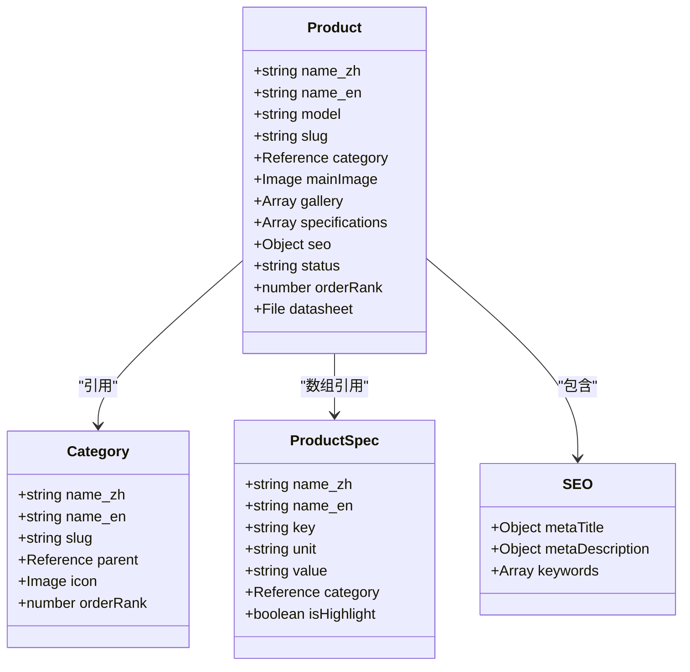

**图表来源**
- [product.ts:4-233](file://sanity/schemas/product.ts#L4-L233)
- [category.ts:4-74](file://sanity/schemas/category.ts#L4-L74)
- [productSpec.ts:4-58](file://sanity/schemas/productSpec.ts#L4-L58)

**核心字段设计：**

**多语言支持结构：**
- 产品名称：中英文必填，支持印尼语、泰语、越南语、阿拉伯语
- 产品描述：支持文本格式
- 简短描述：用于列表展示
- SEO元数据：完整的多语言支持

**验证规则：**
- 必填字段：产品名称、URL标识、产品型号、分类、主图
- 数值验证：排序权重必须为数字
- 格式验证：邮箱、电话号码格式检查

**关系映射：**
- 一对一关系：主图与产品
- 一对多关系：产品图集与产品
- 多对多关系：产品规格参数与产品（通过引用数组）

**章节来源**
- [product.ts:8-233](file://sanity/schemas/product.ts#L8-L233)

### 水暖卫浴专用产品模型 (Product.Plumbing)

**新增** 水暖卫浴专用产品模型，专为卫浴设备行业设计，包含行业特有的字段和配置。

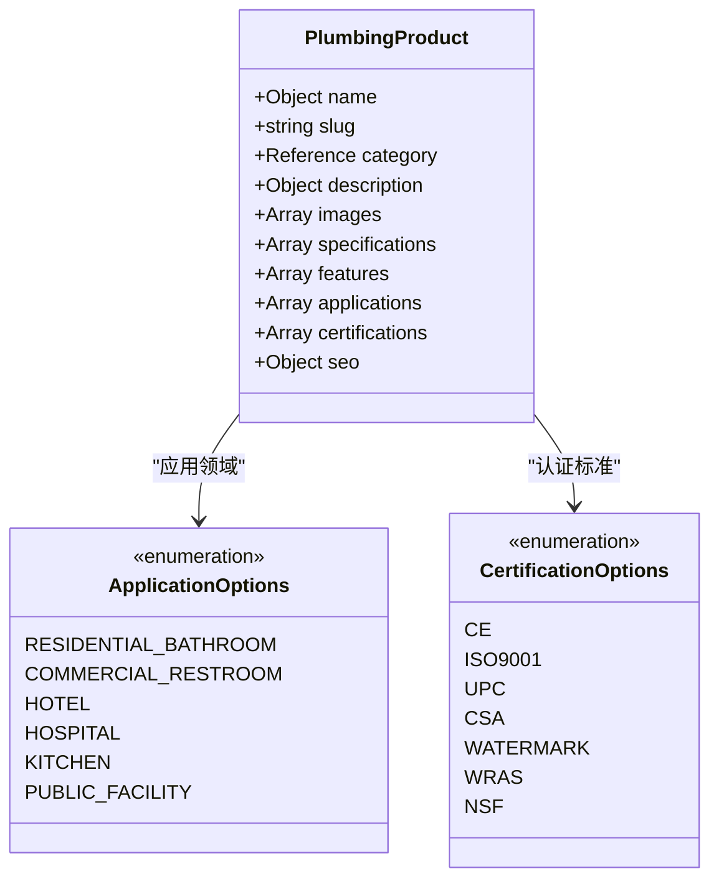

**图表来源**
- [product.plumbing.ts:10-261](file://sanity/schemas/product.plumbing.ts#L10-L261)

**专业字段设计：**

**应用领域配置：**
- 住宅卫生间、商业洗手间、酒店、医院、厨房、公共设施等预定义选项
- 支持多选，便于产品定位和营销

**认证标准管理：**
- CE、ISO 9001、UPC、CSA、WaterMark、WRAS、NSF等国际认证
- 确保产品符合不同市场的合规要求

**特色功能展示：**
- 专门的特性字段，突出产品的关键卖点
- 支持中英文双语描述

**章节来源**
- [product.plumbing.ts:170-212](file://sanity/schemas/product.plumbing.ts#L170-L212)

### 通用产品模型 (Product.Generic)

**新增** 通用产品模型，提供最简化的产品管理功能，适用于各种基础行业需求。

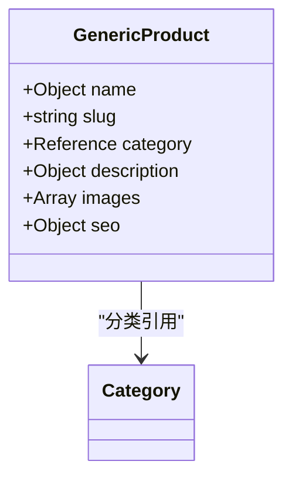

**图表来源**
- [product.generic.ts:4-106](file://sanity/schemas/product.generic.ts#L4-L106)

**核心特性：**
- **最小化字段集**：仅包含产品管理的基本必需字段
- **多语言支持**：完整的中英文支持
- **SEO优化**：内置SEO元数据管理
- **灵活扩展**：可根据需要添加额外字段

**适用场景：**
- 新兴行业或初创企业
- 产品线相对简单的企业
- 需要快速上线的项目

**章节来源**
- [product.generic.ts:8-96](file://sanity/schemas/product.generic.ts#L8-L96)

### 文章模型 (Article)

文章模型专门用于管理公司的资讯内容，支持完整的新闻和博客功能。

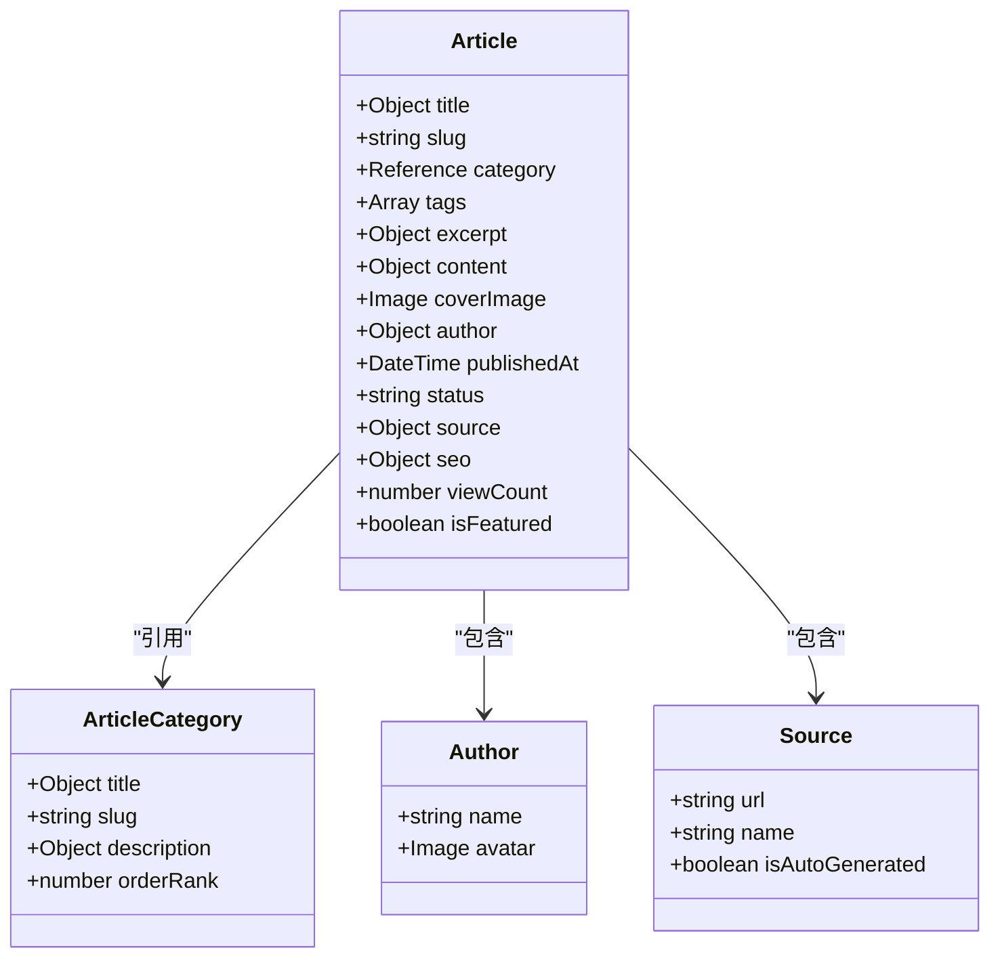

**图表来源**
- [article.ts:4-265](file://sanity/schemas/article.ts#L4-L265)
- [articleCategory.ts:4-59](file://sanity/schemas/articleCategory.ts#L4-L59)

**富文本编辑器配置：**
- 支持标题、段落、列表等块级元素
- 图片插入和热点标注功能
- 多语言内容管理
- 自动化内容生成支持

**章节来源**
- [article.ts:68-129](file://sanity/schemas/article.ts#L68-L129)

### 询单模型 (Inquiry)

询单模型用于跟踪和管理客户询价请求，支持完整的销售线索管理。

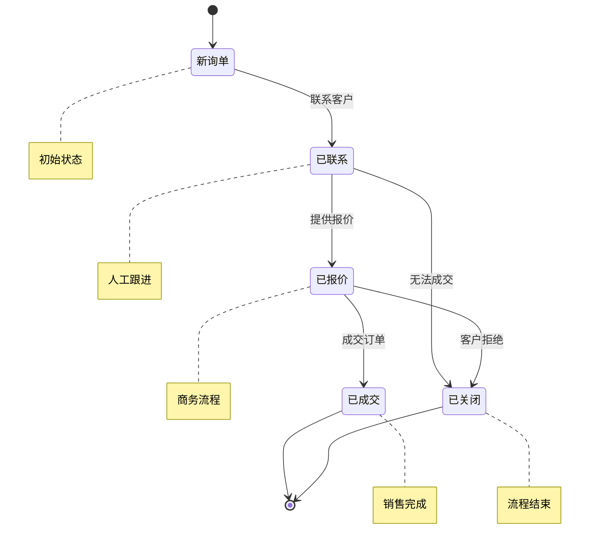

**图表来源**
- [inquiry.ts:74-87](file://sanity/schemas/inquiry.ts#L74-L87)

**字段设计：**
- 客户基本信息：公司名称、联系人、邮箱、电话、国家
- 产品意向：感兴趣的产品和采购数量
- 沟通状态：完整的状态跟踪系统
- 跟进记录：备注和处理历史

**章节来源**
- [inquiry.ts:12-99](file://sanity/schemas/inquiry.ts#L12-L99)

### 数据类型定义

系统支持多种专业字段类型，满足LED和光电行业的特殊需求。

**富文本编辑类型：**
- 支持标题、段落、列表等块级元素
- 图片嵌入和热点标注功能
- 多语言内容容器

**媒体上传类型：**
- 图像文件：支持热点标注和裁剪
- 文件上传：PDF文档下载
- 媒体资源管理

**专业字段类型：**
- 参考类型：文档间的关系引用
- 数组类型：多值字段管理
- 对象类型：结构化数据存储
- 选择类型：预定义选项列表

**章节来源**
- [product.ts:76-90](file://sanity/schemas/product.ts#L76-L90)
- [article.ts:74-128](file://sanity/schemas/article.ts#L74-L128)

## 产品模型对比分析

**新增** 系统现在提供三种不同级别的产品模型，满足不同行业和复杂度的需求。

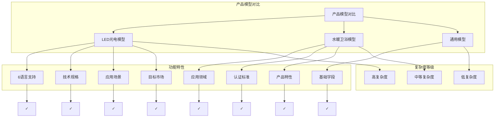

**图表来源**
- [product.ts:9-233](file://sanity/schemas/product.ts#L9-L233)
- [product.plumbing.ts:10-261](file://sanity/schemas/product.plumbing.ts#L10-L261)
- [product.generic.ts:8-106](file://sanity/schemas/product.generic.ts#L8-L106)

### LED光电模型（传统产品）

**特点：**
- 支持6种语言的完整多语言系统
- 详细的技术规格参数管理
- 应用场景和目标市场的深度分析
- 产品特性数组支持
- 数据表文档管理

**适用场景：**
- LED和光电产品制造商
- 需要详细技术参数展示的企业
- 多语言国际市场营销

### 水暖卫浴模型（专业定制）

**新增功能：**
- 专门的应用领域选项（住宅、商业、酒店等）
- 行业认证标准管理（CE、ISO、NSF等）
- 产品特性突出展示
- 卫浴行业专业术语支持

**适用场景：**
- 卫浴设备制造商和供应商
- 需要合规认证管理的企业
- 专业卫浴产品展示

### 通用模型（基础简化）

**特点：**
- 最小化的字段集合
- 专注于核心产品信息
- 易于理解和使用
- 适合快速部署

**适用场景：**
- 新兴行业或初创企业
- 产品线相对简单的企业
- 预算有限的项目

**章节来源**
- [product.ts:9-233](file://sanity/schemas/product.ts#L9-L233)
- [product.plumbing.ts:10-261](file://sanity/schemas/product.plumbing.ts#L10-L261)
- [product.generic.ts:8-106](file://sanity/schemas/product.generic.ts#L8-L106)

## 行业模板系统

**新增** 系统现在支持多行业模板，通过行业预设快速切换不同的业务模式。

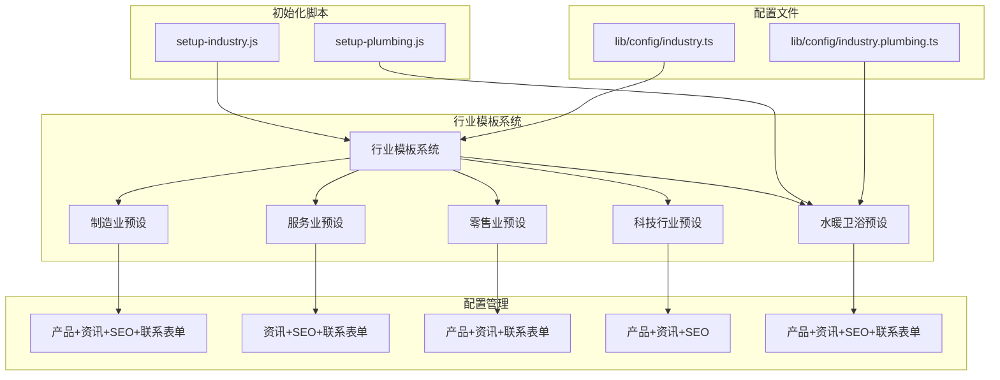

**图表来源**
- [setup-industry.js:18-43](file://scripts/setup-industry.js#L18-L43)
- [setup-plumbing.js:30-62](file://scripts/setup-plumbing.js#L30-L62)
- [industry.ts:33-39](file://lib/config/industry.ts#L33-L39)
- [industry.plumbing.ts:8-14](file://lib/config/industry.plumbing.ts#L8-L14)

### 行业预设配置

**行业预设接口：**
- `name`: 行业名称
- `description`: 行业描述
- `features`: 启用的功能列表
- `contentTypes`: 使用的内容类型

**支持的行业：**
- **制造业**：产品中心、资讯中心、GEO-SEO、联系表单
- **服务业**：资讯中心、GEO-SEO、联系表单
- **零售业**：产品中心、资讯中心、联系表单
- **科技行业**：产品中心、资讯中心、GEO-SEO
- **水暖卫浴**：产品中心、资讯中心、GEO-SEO、联系表单

### 水暖卫浴行业配置

**新增** 专门针对水暖卫浴行业的配置文件，包含行业特定的设置。

**配置特性：**
- **站点信息**：公司名称、描述、行业类型、主色调
- **功能开关**：产品中心、资讯中心、GEO-SEO、联系表单等
- **产品分类**：水龙头、花洒、马桶、面盆等专业分类
- **关键词库**：中英文关键词，支持SEO优化
- **术语库**：专业术语翻译，支持AI优化

**初始化流程：**
1. 创建环境变量配置
2. 更新行业配置文件
3. 生成产品分类建议
4. 提供后续操作指导

**章节来源**
- [setup-plumbing.js:1-100](file://scripts/setup-plumbing.js#L1-L100)
- [industry.plumbing.ts:1-120](file://lib/config/industry.plumbing.ts#L1-L120)
- [industry.ts:1-65](file://lib/config/industry.ts#L1-L65)

## 依赖关系分析

系统各组件之间的依赖关系清晰明确，遵循模块化设计原则。

```mermaid
graph TD
subgraph "配置层"
SANITY_CONFIG[Sanity 配置]
SANITY_CLI[CLI 配置]
INDUSTRY_CONFIG[行业配置]
END
subgraph "Schema 层"
PRODUCT_SCHEMA[产品 Schema]
PLUMBING_PRODUCT_SCHEMA[水暖卫浴产品 Schema]
GENERIC_PRODUCT_SCHEMA[通用产品 Schema]
CATEGORY_SCHEMA[分类 Schema]
ARTICLE_SCHEMA[文章 Schema]
INQUIRY_SCHEMA[询单 Schema]
SPEC_SCHEMA[规格 Schema]
ARTICLE_CATEGORY_SCHEMA[文章分类 Schema]
end
subgraph "应用层"
FRONTEND_APP[前端应用]
STUDIO_APP[Studio 应用]
API_ROUTES[API 路由]
INDUSTRY_SCRIPTS[行业脚本]
end
subgraph "工具层"
IMPORT_SCRIPT[数据导入脚本]
SEED_SCRIPT[种子数据脚本]
PLUMBING_SETUP[水暖卫浴初始化]
INDUSTRY_SETUP[行业模板脚本]
CRAWLER_SCRIPT[爬虫脚本]
end
SANITY_CONFIG --> PRODUCT_SCHEMA
SANITY_CONFIG --> PLUMBING_PRODUCT_SCHEMA
SANITY_CONFIG --> GENERIC_PRODUCT_SCHEMA
SANITY_CONFIG --> CATEGORY_SCHEMA
SANITY_CONFIG --> ARTICLE_SCHEMA
SANITY_CONFIG --> INQUIRY_SCHEMA
SANITY_CONFIG --> SPEC_SCHEMA
SANITY_CONFIG --> ARTICLE_CATEGORY_SCHEMA
INDUSTRY_CONFIG --> PLUMBING_SETUP
INDUSTRY_CONFIG --> INDUSTRY_SETUP
PRODUCT_SCHEMA --> FRONTEND_APP
PLUMBING_PRODUCT_SCHEMA --> FRONTEND_APP
GENERIC_PRODUCT_SCHEMA --> FRONTEND_APP
CATEGORY_SCHEMA --> FRONTEND_APP
ARTICLE_SCHEMA --> FRONTEND_APP
INQUIRY_SCHEMA --> FRONTEND_APP
SANITY_CLI --> IMPORT_SCRIPT
SANITY_CLI --> SEED_SCRIPT
SANITY_CLI --> CRAWLER_SCRIPT
PLUMBING_SETUP --> INDUSTRY_CONFIG
INDUSTRY_SETUP --> INDUSTRY_CONFIG
```

**图表来源**
- [sanity.config.ts:1-33](file://sanity/sanity.config.ts#L1-L33)
- [index.ts:1-9](file://sanity/schemas/index.ts#L1-L9)
- [setup-plumbing.js:30-62](file://scripts/setup-plumbing.js#L30-L62)
- [industry.ts:33-57](file://lib/config/industry.ts#L33-L57)

**依赖关系特点：**
- Schema层向应用层提供数据接口
- CLI配置向工具层提供API访问权限
- 行业配置影响产品模型的选择和行为
- 前端应用通过客户端库访问Sanity API
- 工具脚本独立于主应用运行

**章节来源**
- [sanity.config.ts:18-25](file://sanity/sanity.config.ts#L18-L25)
- [sanity/cli.ts:3-8](file://sanity/sanity.cli.ts#L3-L8)

## 性能考虑

### 缓存策略

系统采用多层缓存机制来优化性能：

**CDN缓存：**
- 静态资源通过CDN加速分发
- 图像资源支持热点标注和自适应尺寸
- API响应数据缓存策略

**数据库优化：**
- 合理的索引设计
- 查询优化和分页处理
- 关联数据的预加载策略

### 性能监控

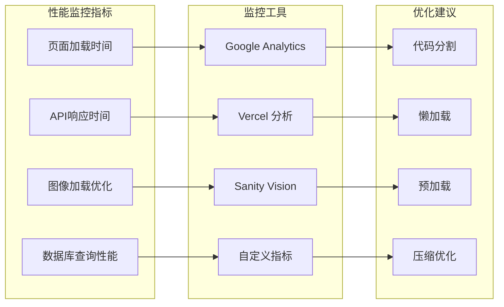

## 故障排除指南

### 常见问题解决

**连接问题：**
- 检查项目ID和数据集配置
- 验证API密钥权限设置
- 确认网络连接和防火墙设置

**数据同步问题：**
- 检查Schema定义的一致性
- 验证数据格式和类型匹配
- 确认引用关系的完整性

**性能问题：**
- 分析查询复杂度和索引使用
- 优化图像资源和缓存策略
- 监控API使用限制和配额

**行业模板问题：**
- 确认行业预设配置正确
- 检查产品模型选择逻辑
- 验证行业特定字段的兼容性

### 调试工具

**开发工具：**
- Sanity Vision用于查询调试
- 浏览器开发者工具
- 日志记录和错误追踪

**生产监控：**
- 性能指标监控
- 错误日志分析
- 用户行为追踪

**章节来源**
- [sanity.cli.ts:4-7](file://sanity/sanity.cli.ts#L4-L7)
- [client.ts:9-15](file://lib/sanity/client.ts#L9-L15)

## 结论

GoPro Trade网站的Sanity CMS系统提供了一个功能完整、易于扩展的内容管理解决方案。通过精心设计的Schema结构、强大的多语言支持和专业的数据类型，系统能够有效管理LED和光电行业的复杂内容需求。

**主要优势：**
- 模块化架构设计，便于维护和扩展
- 完善的多语言支持，满足国际化业务需求
- 专业的Schema设计，确保数据结构的合理性
- 强大的可视化编辑器，提升内容创作效率
- **多行业模板支持，适应不同业务场景**
- **专用产品模型，满足行业特定需求**
- **灵活的配置系统，快速切换业务模式**
- **增强的产品规格参数管理，支持详细技术规格和认证跟踪**

**未来发展建议：**
- 继续完善自动化工具链
- 优化性能监控和分析功能
- 扩展移动端适配能力
- 增强数据分析和报告功能
- **开发更多行业模板，扩大适用范围**
- **增强AI辅助功能，提升内容创作效率**

## 附录

### 安装和配置指南

**环境要求：**
- Node.js 16+
- npm 8+
- Sanity CLI 3+

**安装步骤：**
1. 克隆项目仓库
2. 安装依赖包
3. 配置环境变量
4. 启动开发服务器

**配置文件：**
- 项目ID和数据集配置
- API密钥管理
- 国际化设置
- 插件配置
- **行业模板配置**

### API参考

**核心API端点：**
- `/api/inquiry` - 询单提交接口
- `/api/sitemap` - 站点地图生成
- `/api/cron/news` - 新闻自动更新

**数据模型API：**
- 产品数据查询
- 分类数据管理
- 文章内容获取
- 询单状态跟踪
- **行业特定数据获取**

### 最佳实践

**内容管理：**
- 建立标准化的内容创作流程
- 实施严格的审核机制
- 维护内容版本历史
- 定期备份重要数据

**性能优化：**
- 合理使用缓存策略
- 优化图像资源大小
- 实施CDN加速
- 监控系统性能指标

**安全考虑：**
- 保护API密钥和令牌
- 实施访问控制机制
- 定期更新安全补丁
- 监控异常访问行为

**行业模板使用：**
- **根据业务需求选择合适的行业模板**
- **定期更新行业配置和关键词库**
- **利用行业特定字段优化SEO表现**
- **结合AI工具提升内容质量和翻译准确性**
- **充分利用水暖卫浴模型的专业认证和应用领域功能**