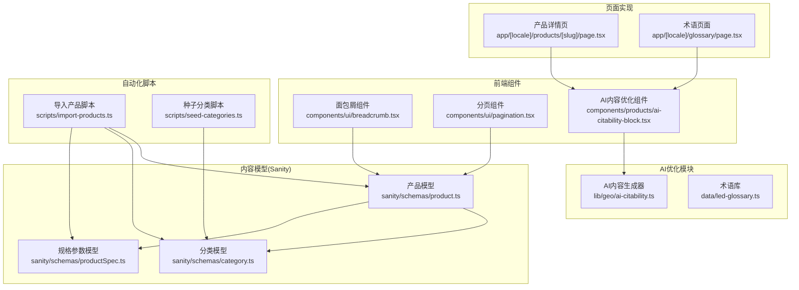
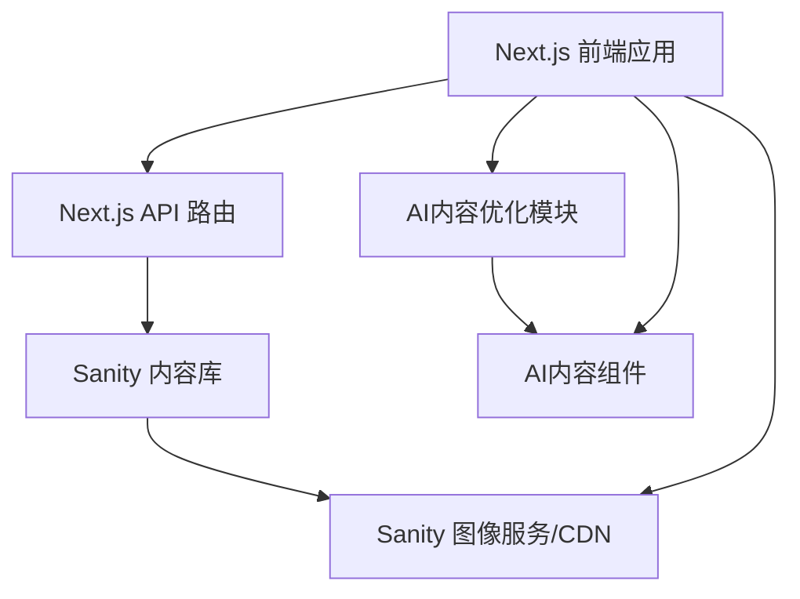
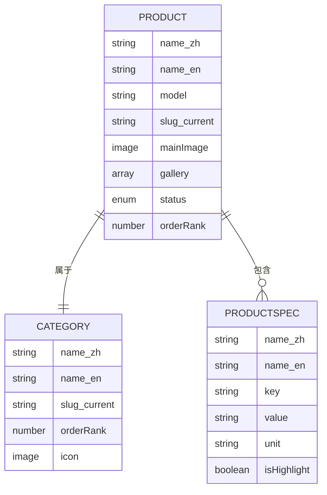
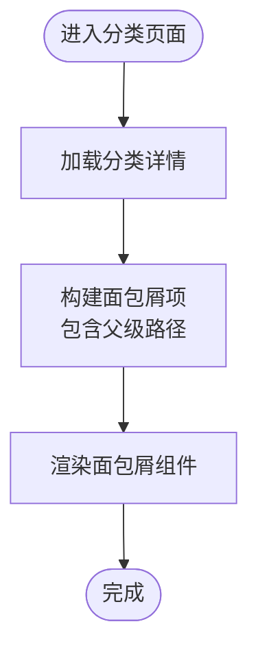
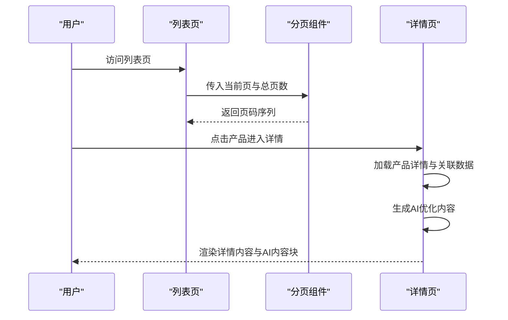
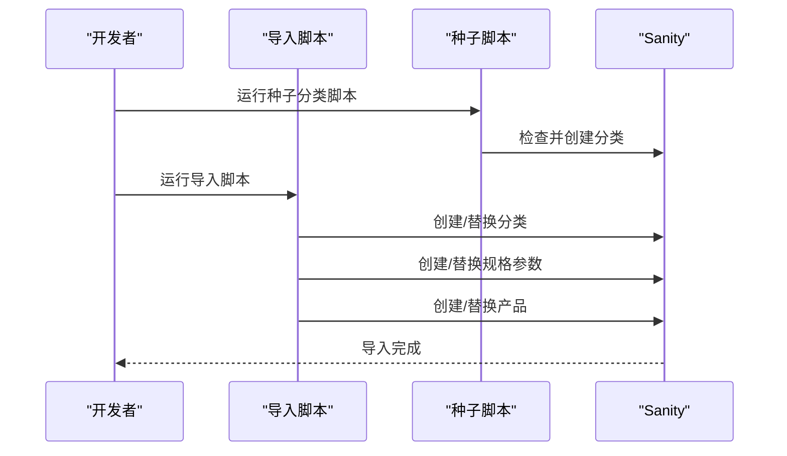
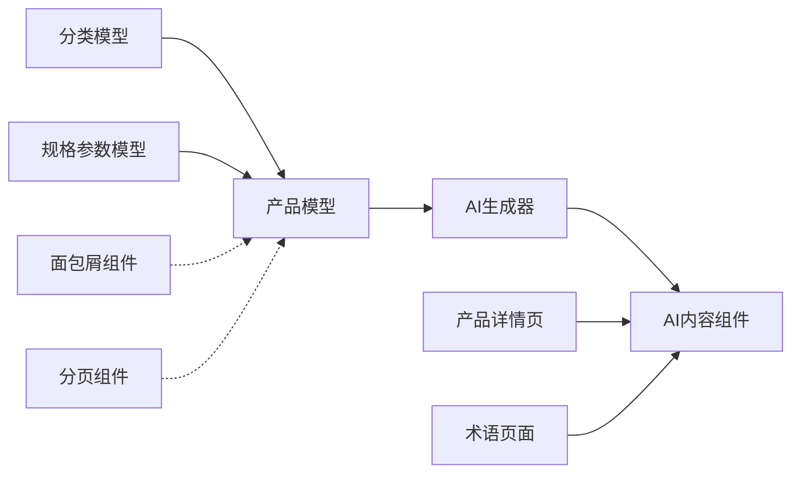

# 产品管理系统

<cite>
**本文引用的文件**
- [sanity/schemas/product.ts](file://sanity/schemas/product.ts)
- [sanity/schemas/category.ts](file://sanity/schemas/category.ts)
- [sanity/schemas/productSpec.ts](file://sanity/schemas/productSpec.ts)
- [scripts/import-products.ts](file://scripts/import-products.ts)
- [scripts/seed-categories.ts](file://scripts/seed-categories.ts)
- [components/ui/breadcrumb.tsx](file://components/ui/breadcrumb.tsx)
- [components/ui/pagination.tsx](file://components/ui/pagination.tsx)
- [components/products/ai-citability-block.tsx](file://components/products/ai-citability-block.tsx)
- [lib/geo/ai-citability.ts](file://lib/geo/ai-citability.ts)
- [app/[locale]/products/[slug]/page.tsx](file://app/[locale]/products/[slug]/page.tsx)
- [app/[locale]/glossary/page.tsx](file://app/[locale]/glossary/page.tsx)
- [data/led-glossary.ts](file://data/led-glossary.ts)
</cite>

## 更新摘要
**所做更改**
- 新增AI内容优化功能章节，详细介绍AI Citability内容生成与展示
- 更新产品展示逻辑，包含AI生成的SEO优化内容块
- 新增术语页面的AI优化定义展示
- 扩展产品页面的SEO增强功能说明

## 目录
1. [简介](#简介)
2. [项目结构](#项目结构)
3. [核心组件](#核心组件)
4. [架构总览](#架构总览)
5. [详细组件分析](#详细组件分析)
6. [AI内容优化功能](#ai内容优化功能)
7. [依赖关系分析](#依赖关系分析)
8. [性能考虑](#性能考虑)
9. [故障排查指南](#故障排查指南)
10. [结论](#结论)
11. [附录](#附录)

## 简介
本文件面向 GoPro Trade 的产品管理与前端展示系统，围绕以下目标进行系统化文档化：
- 产品数据模型：产品基本信息、规格参数、图片资源、SEO 字段等核心属性定义与关系。
- 产品分类体系：层级分类、分类筛选、面包屑导航的实现思路与最佳实践。
- 展示逻辑：列表页分页、详情页渲染、相关产品推荐的流程与实现要点。
- 搜索与过滤：关键词搜索、分类筛选、价格范围过滤等高级功能的设计建议。
- 图片优化：Sanity CDN 集成、响应式图片、懒加载等性能优化策略。
- AI内容优化：基于GEO（生成式引擎优化）原则的AI生成内容块，增强SEO表现。
- 数据导入导出：自动化脚本的使用方法与注意事项。
- 最佳实践与常见问题：基于现有代码与脚本的总结。

## 项目结构
本项目采用 Next.js 应用结构，产品相关内容主要分布在以下位置：
- Sanity 内容模型：位于 sanity/schemas 下，定义产品、分类、规格参数等数据结构。
- 前端组件：components/ui 提供面包屑与分页组件，components/products 提供AI内容优化组件。
- AI优化模块：lib/geo 下的AI内容生成器，支持产品描述、术语定义、对比分析等。
- 页面实现：app/[locale]/products 和 app/[locale]/glossary 页面集成AI优化功能。
- 自动化脚本：scripts 目录下包含产品导入、分类种子数据等脚本，用于数据初始化与迁移。

**图表来源**
- [sanity/schemas/product.ts:1-233](file://sanity/schemas/product.ts#L1-L233)
- [sanity/schemas/category.ts:1-74](file://sanity/schemas/category.ts#L1-L74)
- [sanity/schemas/productSpec.ts:1-58](file://sanity/schemas/productSpec.ts#L1-L58)
- [components/ui/breadcrumb.tsx:1-87](file://components/ui/breadcrumb.tsx#L1-L87)
- [components/ui/pagination.tsx:1-83](file://components/ui/pagination.tsx#L1-L83)
- [components/products/ai-citability-block.tsx:1-178](file://components/products/ai-citability-block.tsx#L1-L178)
- [lib/geo/ai-citability.ts:1-196](file://lib/geo/ai-citability.ts#L1-L196)
- [app/[locale]/products/[slug]/page.tsx:1-467](file://app/[locale]/products/[slug]/page.tsx#L1-L467)
- [app/[locale]/glossary/page.tsx:1-167](file://app/[locale]/glossary/page.tsx#L1-L167)
- [data/led-glossary.ts:1-149](file://data/led-glossary.ts#L1-L149)

**章节来源**
- [sanity/schemas/product.ts:1-233](file://sanity/schemas/product.ts#L1-L233)
- [sanity/schemas/category.ts:1-74](file://sanity/schemas/category.ts#L1-L74)
- [sanity/schemas/productSpec.ts:1-58](file://sanity/schemas/productSpec.ts#L1-L58)
- [components/ui/breadcrumb.tsx:1-87](file://components/ui/breadcrumb.tsx#L1-L87)
- [components/ui/pagination.tsx:1-83](file://components/ui/pagination.tsx#L1-L83)
- [components/products/ai-citability-block.tsx:1-178](file://components/products/ai-citability-block.tsx#L1-L178)
- [lib/geo/ai-citability.ts:1-196](file://lib/geo/ai-citability.ts#L1-L196)
- [app/[locale]/products/[slug]/page.tsx:1-467](file://app/[locale]/products/[slug]/page.tsx#L1-L467)
- [app/[locale]/glossary/page.tsx:1-167](file://app/[locale]/glossary/page.tsx#L1-L167)
- [data/led-glossary.ts:1-149](file://data/led-glossary.ts#L1-L149)

## 核心组件
本节聚焦产品数据模型与前端展示组件，解释其职责、字段含义与交互关系。

- 产品模型（sanity/schemas/product.ts）
  - 多语言字段：名称、描述、简短描述、特性、应用场景、SEO 标题与描述。
  - 关联字段：分类（参考）、规格参数（数组引用）、主图与图集。
  - 其他：型号、状态、排序权重、数据手册、URL 标识等。
  - 预览选择：标题、副标题、媒体（主图）。

- 分类模型（sanity/schemas/category.ts）
  - 多语言名称、描述、URL 标识。
  - 层级关系：父级分类引用，支持树形结构。
  - 排序权重与图标。

- 规格参数模型（sanity/schemas/productSpec.ts）
  - 参数键名（程序识别）、参数值、单位、是否高亮、所属分类。

- 面包屑组件（components/ui/breadcrumb.tsx）
  - 生成结构化数据（JSON-LD BreadcrumbList），支持 RTL 布局。
  - 渲染可见面包屑，最后一页无链接。

- 分页组件（components/ui/pagination.tsx）
  - 生成页码序列与分页链接，支持 RTL 方向。
  - 当总页数较多时采用省略号分段显示。

- AI内容优化组件（components/products/ai-citability-block.tsx）
  - 支持可展开的问答式内容块，包含问题标题、答案、数据点列表和关键词标签。
  - 提供FAQ列表组件和对比表格组件，增强内容展示效果。

**章节来源**
- [sanity/schemas/product.ts:1-233](file://sanity/schemas/product.ts#L1-L233)
- [sanity/schemas/category.ts:1-74](file://sanity/schemas/category.ts#L1-L74)
- [sanity/schemas/productSpec.ts:1-58](file://sanity/schemas/productSpec.ts#L1-L58)
- [components/ui/breadcrumb.tsx:1-87](file://components/ui/breadcrumb.tsx#L1-L87)
- [components/ui/pagination.tsx:1-83](file://components/ui/pagination.tsx#L1-L83)
- [components/products/ai-citability-block.tsx:1-178](file://components/products/ai-citability-block.tsx#L1-L178)

## 架构总览
系统采用"内容即服务"模式，前端通过 API 获取 Sanity 中的产品、分类与规格数据，再结合 UI 组件完成页面渲染与交互。新增的AI内容优化模块基于GEO（生成式引擎优化）原则，为产品页面提供SEO友好的AI生成内容。

**图表来源**
- [sanity/schemas/product.ts:1-233](file://sanity/schemas/product.ts#L1-L233)
- [sanity/schemas/category.ts:1-74](file://sanity/schemas/category.ts#L1-L74)
- [sanity/schemas/productSpec.ts:1-58](file://sanity/schemas/productSpec.ts#L1-L58)
- [components/ui/breadcrumb.tsx:1-87](file://components/ui/breadcrumb.tsx#L1-L87)
- [components/ui/pagination.tsx:1-83](file://components/ui/pagination.tsx#L1-L83)
- [components/products/ai-citability-block.tsx:1-178](file://components/products/ai-citability-block.tsx#L1-L178)
- [lib/geo/ai-citability.ts:1-196](file://lib/geo/ai-citability.ts#L1-L196)

## 详细组件分析

### 产品数据模型分析
- 字段组织与复杂度
  - 多语言对象字段：名称、描述、简短描述、特性、应用场景、SEO 标题与描述，均为对象类型，包含多语言键（如 zh、en、id、th、vi、ar）。复杂度与查询时的语言选择相关。
  - 关联字段：分类为单引用；规格参数为数组引用，支持一对多关系，查询时需注意反向解析。
  - 图片资源：主图与图集均为图像类型，支持热点编辑，便于裁剪与焦点定位。
  - 文件资源：数据手册为文件类型，限制 PDF。
  - 元数据：状态枚举、排序权重、URL 标识等，影响展示顺序与路由生成。

- 数据流与依赖链
  - 产品文档依赖分类与规格参数文档；分类支持父子关系形成层级。
  - 预览配置选择标题、副标题与媒体，便于后台预览。

**图表来源**
- [sanity/schemas/product.ts:1-233](file://sanity/schemas/product.ts#L1-L233)
- [sanity/schemas/category.ts:1-74](file://sanity/schemas/category.ts#L1-L74)
- [sanity/schemas/productSpec.ts:1-58](file://sanity/schemas/productSpec.ts#L1-L58)

**章节来源**
- [sanity/schemas/product.ts:1-233](file://sanity/schemas/product.ts#L1-L233)
- [sanity/schemas/category.ts:1-74](file://sanity/schemas/category.ts#L1-L74)
- [sanity/schemas/productSpec.ts:1-58](file://sanity/schemas/productSpec.ts#L1-L58)

### 分类系统与层级关系
- 层级分类
  - 通过父级分类引用实现层级，支持多级嵌套；顶级分类父级为空。
  - 排序权重用于控制分类在前端的展示顺序。

- 分类筛选
  - 在前端可通过分类 ID 或路径进行筛选；层级关系可用于构建筛选树或面包屑。

- 面包屑导航
  - 面包屑组件会根据传入的条目生成结构化数据与可见导航，最后一页不带链接。

**图表来源**
- [sanity/schemas/category.ts:1-74](file://sanity/schemas/category.ts#L1-L74)
- [components/ui/breadcrumb.tsx:1-87](file://components/ui/breadcrumb.tsx#L1-L87)

**章节来源**
- [sanity/schemas/category.ts:1-74](file://sanity/schemas/category.ts#L1-L74)
- [components/ui/breadcrumb.tsx:1-87](file://components/ui/breadcrumb.tsx#L1-L87)

### 列表页分页与详情页渲染
- 列表页分页
  - 分页组件根据当前页与总页数生成页码序列，支持省略号分段显示与 RTL 方向。
  - 通过查询参数 page 控制页码，保持链接一致性。

- 详情页渲染
  - 使用产品 slug 作为路由参数，从内容库获取产品详情。
  - 渲染主图、图集、规格参数、特性、应用场景、SEO 信息等。
  - **新增**：集成AI内容优化模块，生成SEO友好的产品描述内容块。

**图表来源**
- [components/ui/pagination.tsx:1-83](file://components/ui/pagination.tsx#L1-L83)
- [sanity/schemas/product.ts:1-233](file://sanity/schemas/product.ts#L1-L233)
- [lib/geo/ai-citability.ts:1-196](file://lib/geo/ai-citability.ts#L1-L196)
- [components/products/ai-citability-block.tsx:1-178](file://components/products/ai-citability-block.tsx#L1-L178)

**章节来源**
- [components/ui/pagination.tsx:1-83](file://components/ui/pagination.tsx#L1-L83)
- [sanity/schemas/product.ts:1-233](file://sanity/schemas/product.ts#L1-L233)
- [lib/geo/ai-citability.ts:1-196](file://lib/geo/ai-citability.ts#L1-L196)
- [components/products/ai-citability-block.tsx:1-178](file://components/products/ai-citability-block.tsx#L1-L178)

### 相关产品推荐
- 设计建议
  - 基于产品分类与目标市场进行关联推荐。
  - 可按排序权重与状态筛选有效产品。
  - 对高亮规格参数进行优先展示，提升相关性。

- 实现要点
  - 查询同一分类下的其他产品，排除当前产品。
  - 控制返回数量与字段，避免过度渲染。

### 搜索与过滤机制
- 关键词搜索
  - 建议在前端对产品名称、简短描述、特性、应用场景进行全文检索。
  - 多语言环境下需分别处理不同语言字段。

- 分类筛选
  - 通过分类 ID 或路径进行筛选，支持多选与层级联动。

- 价格范围过滤
  - 当前模型未内置价格字段，可在产品模型中新增价格相关字段，并在前端提供范围滑块与输入框。

- 高级过滤
  - 目标市场、状态、排序权重等均可作为过滤条件。
  - 建议提供"重置筛选"与"保存筛选条件"的交互。

### 产品图片优化策略
- Sanity CDN 集成
  - 使用 Sanity 图像服务进行裁剪、缩放与格式优化，减少带宽与加载时间。
  - 主图与图集均支持热点编辑，确保关键区域清晰。

- 响应式图片
  - 前端根据设备像素比与屏幕宽度动态选择合适尺寸与格式。
  - 使用现代格式（如 WebP）以降低体积。

- 懒加载
  - 图片组件默认延迟加载，提升首屏性能。
  - 首屏关键图片可设置预加载策略。

### 数据导入与导出自动化脚本
- 导入产品脚本（scripts/import-products.ts）
  - 功能：批量导入分类、规格参数与产品文档，自动建立引用关系。
  - 流程：先导入分类，再导入规格参数，最后导入产品并写入 SEO 信息。
  - 注意：需要配置 Sanity 项目 ID、数据集与访问令牌。

- 种子分类脚本（scripts/seed-categories.ts）
  - 功能：初始化常用分类，避免重复创建。
  - 流程：检查是否存在相同 slug 的分类，不存在则创建。

**图表来源**
- [scripts/import-products.ts:1-161](file://scripts/import-products.ts#L1-L161)
- [scripts/seed-categories.ts:1-110](file://scripts/seed-categories.ts#L1-L110)

**章节来源**
- [scripts/import-products.ts:1-161](file://scripts/import-products.ts#L1-L161)
- [scripts/seed-categories.ts:1-110](file://scripts/seed-categories.ts#L1-L110)

## AI内容优化功能

### GEO（生成式引擎优化）原则
AI内容优化功能基于GEO最佳实践，确保生成的内容具备以下特征：
- **长度规范**：134-167个词（约200-250字），适中且易于AI理解
- **结构完整**：自包含、事实丰富、直接回答问题
- **格式清晰**：包含明确的定义、数据支撑、对比说明
- **SEO友好**：包含相关关键词，提升搜索引擎可见性

### AI内容生成器（lib/geo/ai-citability.ts）
提供多种类型的AI优化内容生成函数：

- **产品描述生成**：`generateCitableProductDescription`
  - 输入：产品名称、分类、特性、规格参数、应用场景
  - 输出：包含问题、答案、数据点、关键词的完整内容结构

- **技术定义生成**：`generateCitableDefinition`
  - 输入：术语、定义、上下文、示例
  - 输出：技术术语的AI优化定义

- **对比分析生成**：`generateCitableComparison`
  - 输入：两个产品的对比维度
  - 输出：详细的对比分析内容

- **最佳实践生成**：`generateCitableBestPractices`
  - 输入：主题、步骤、注意事项
  - 输出：实用的最佳实践指南

- **统计数据生成**：`generateCitableStatistics`
  - 输入：主题、统计数据
  - 输出：行业统计数据的AI优化版本

### AI内容展示组件（components/products/ai-citability-block.tsx）
提供多种内容展示组件：

- **AICitableContentBlock**：问答式内容块
  - 支持展开/收起功能
  - 显示关键数据点列表
  - 提供关键词标签云
  - SEO友好的H2标题结构

- **FAQList**：常见问题列表
  - 支持多FAQ项目的展开/收起
  - 响应式设计，支持移动端操作

- **ComparisonTable**：技术规格对比表
  - 清晰展示两个产品的技术参数对比
  - 支持横向滚动，适配小屏幕设备

### 产品页面集成（app/[locale]/products/[slug]/page.tsx）
在产品详情页中集成AI优化功能：

- **内容生成**：使用`generateCitableProductDescription`生成产品描述
- **FAQ生成**：使用`generateProductFAQs`生成相关问题
- **组件展示**：渲染AICitableContentBlock和FAQList组件
- **SEO增强**：为AI搜索引擎提供结构化、可引用的内容

### 术语页面集成（app/[locale]/glossary/page.tsx）
在术语表页面中应用AI优化：

- **术语定义**：使用`getAIOptimizedDefinition`获取AI优化版本
- **批量展示**：为每个术语生成标准的AI内容块
- **SEO优化**：提升术语页面在AI搜索中的表现

### 术语库（data/led-glossary.ts）
包含LED行业专业术语的AI优化定义：

- **结构化数据**：包含术语、分类、定义、AI优化版本、关键词
- **应用场景**：涵盖IR LED、UV LED、波长、SMD LED等核心概念
- **关键词优化**：为每个术语提供相关搜索关键词

**章节来源**
- [lib/geo/ai-citability.ts:1-196](file://lib/geo/ai-citability.ts#L1-L196)
- [components/products/ai-citability-block.tsx:1-178](file://components/products/ai-citability-block.tsx#L1-L178)
- [app/[locale]/products/[slug]/page.tsx:1-467](file://app/[locale]/products/[slug]/page.tsx#L1-L467)
- [app/[locale]/glossary/page.tsx:1-167](file://app/[locale]/glossary/page.tsx#L1-L167)
- [data/led-glossary.ts:1-149](file://data/led-glossary.ts#L1-L149)

## 依赖关系分析
- 模型间依赖
  - 产品依赖分类与规格参数；规格参数可限定到特定分类。
  - 分类支持父子关系，形成树形结构。

- 组件与模型
  - 面包屑组件与分页组件独立于模型，但依赖路由与查询结果。
  - 产品详情页依赖产品模型的多语言字段与关联数据。
  - **新增**：AI内容优化组件依赖AI生成器模块和产品数据。

- AI模块依赖
  - AI内容生成器依赖产品数据模型
  - AI内容组件依赖AI生成器输出
  - 页面组件依赖AI组件和生成器

**图表来源**
- [sanity/schemas/product.ts:1-233](file://sanity/schemas/product.ts#L1-L233)
- [sanity/schemas/category.ts:1-74](file://sanity/schemas/category.ts#L1-L74)
- [sanity/schemas/productSpec.ts:1-58](file://sanity/schemas/productSpec.ts#L1-L58)
- [components/ui/breadcrumb.tsx:1-87](file://components/ui/breadcrumb.tsx#L1-L87)
- [components/ui/pagination.tsx:1-83](file://components/ui/pagination.tsx#L1-L83)
- [lib/geo/ai-citability.ts:1-196](file://lib/geo/ai-citability.ts#L1-L196)
- [components/products/ai-citability-block.tsx:1-178](file://components/products/ai-citability-block.tsx#L1-L178)

**章节来源**
- [sanity/schemas/product.ts:1-233](file://sanity/schemas/product.ts#L1-L233)
- [sanity/schemas/category.ts:1-74](file://sanity/schemas/category.ts#L1-L74)
- [sanity/schemas/productSpec.ts:1-58](file://sanity/schemas/productSpec.ts#L1-L58)
- [components/ui/breadcrumb.tsx:1-87](file://components/ui/breadcrumb.tsx#L1-L87)
- [components/ui/pagination.tsx:1-83](file://components/ui/pagination.tsx#L1-L83)
- [lib/geo/ai-citability.ts:1-196](file://lib/geo/ai-citability.ts#L1-L196)
- [components/products/ai-citability-block.tsx:1-178](file://components/products/ai-citability-block.tsx#L1-L178)

## 性能考虑
- 图片性能
  - 使用 Sanity 图像服务进行自适应裁剪与格式转换。
  - 合理设置图片尺寸与质量，避免超大图片直接加载。
  - 首屏关键图片优先加载，非关键图片懒加载。

- 查询性能
  - 产品详情页尽量只请求必要字段，避免一次性拉取所有多语言内容。
  - 列表页分页时仅请求当前页数据，避免全量加载。
  - **新增**：AI内容生成在服务器端进行，避免客户端性能开销。

- 缓存策略
  - 利用静态生成（SSG）缓存稳定内容，动态内容使用增量静态再生（ISR）。
  - 对频繁访问的分类与产品详情设置短期缓存。
  - **新增**：AI生成内容可缓存以提升性能。

- AI内容优化性能
  - AI内容生成在服务器端执行，减少客户端计算负担。
  - 使用预定义的模板和结构化数据，提高生成效率。
  - 关键词和数据点的生成遵循固定模式，降低复杂度。

## 故障排查指南
- 导入失败
  - 检查 Sanity 项目 ID、数据集与访问令牌配置是否正确。
  - 确认分类与规格参数的引用 ID 是否存在且拼写正确。

- 图片显示异常
  - 确认主图与图集字段已上传有效图片。
  - 检查 Sanity 图像服务可用性与网络连接。

- 面包屑不显示
  - 确保传入的面包屑条目包含正确的标签与链接。
  - 检查结构化数据 JSON-LD 是否正确生成。

- 分页异常
  - 确认当前页与总页数计算正确。
  - 检查查询参数 page 的传递与解析。

- **新增**：AI内容显示问题
  - 检查AI生成器函数是否正确导入和调用
  - 确认产品数据包含必要的字段（名称、分类、规格参数等）
  - 验证AI内容组件的props传递是否正确
  - 检查AI内容的长度和格式是否符合GEO原则

- **新增**：术语页面问题
  - 确认术语库数据是否正确加载
  - 检查AI优化定义函数是否正常工作
  - 验证术语搜索和分类筛选功能

**章节来源**
- [scripts/import-products.ts:1-161](file://scripts/import-products.ts#L1-L161)
- [components/ui/breadcrumb.tsx:1-87](file://components/ui/breadcrumb.tsx#L1-L87)
- [components/ui/pagination.tsx:1-83](file://components/ui/pagination.tsx#L1-L83)
- [lib/geo/ai-citability.ts:1-196](file://lib/geo/ai-citability.ts#L1-L196)
- [components/products/ai-citability-block.tsx:1-178](file://components/products/ai-citability-block.tsx#L1-L178)
- [app/[locale]/glossary/page.tsx:1-167](file://app/[locale]/glossary/page.tsx#L1-L167)

## 结论
本系统以 Sanity 为核心内容库，配合 Next.js 前端与通用 UI 组件，实现了产品数据的结构化管理与高效展示。通过多语言字段、层级分类、结构化 SEO 与响应式图片优化，能够满足国际化与高性能的业务需求。

**新增的AI内容优化功能显著提升了系统的SEO表现和AI可理解性**：
- 基于GEO原则的结构化内容生成，提升AI搜索引擎的抓取效果
- 问答式内容块增强用户体验和内容可读性
- FAQ和对比表格提供更丰富的信息层次
- 术语页面的专业化内容优化，提升行业知识的可发现性

建议后续补充价格字段与价格范围过滤、完善搜索算法与缓存策略，持续提升用户体验与维护效率。AI内容优化功能的成功集成证明了该架构的良好扩展性，为未来的智能化功能升级奠定了基础。

## 附录
- 最佳实践
  - 严格维护多语言字段完整性，避免缺失导致渲染异常。
  - 使用排序权重与状态字段统一管理产品生命周期。
  - 为每个产品维护高质量主图与代表性图集，提升转化率。
  - **新增**：合理利用AI内容优化功能，提升SEO表现和AI可理解性。
  - **新增**：定期更新术语库，保持技术内容的准确性和时效性。

- 常见问题
  - 分类层级过深导致筛选困难：建议限制层级深度或提供搜索框快速定位。
  - 多语言内容更新不一致：建议在后台增加校验与提示机制。
  - **新增**：AI内容质量不稳定：建议建立内容审核机制和质量评估标准。
  - **新增**：术语定义过时：建议定期审查和更新术语库内容。

- **新增**：AI内容优化实施建议
  - 建立AI内容生成的质量控制流程
  - 定期监控AI内容在搜索引擎中的表现
  - 收集用户反馈，持续改进内容生成算法
  - 建立术语库的维护和更新机制
  - 考虑多语言环境下的AI内容本地化

**章节来源**
- [lib/geo/ai-citability.ts:1-196](file://lib/geo/ai-citability.ts#L1-L196)
- [data/led-glossary.ts:1-149](file://data/led-glossary.ts#L1-L149)
- [components/products/ai-citability-block.tsx:1-178](file://components/products/ai-citability-block.tsx#L1-L178)