# 自动化工具

<cite>
**本文引用的文件**
- [scripts/news-auto/index.ts](file://scripts/news-auto/index.ts)
- [scripts/news-auto/crawler.ts](file://scripts/news-auto/crawler.ts)
- [scripts/news-auto/publisher.ts](file://scripts/news-auto/publisher.ts)
- [scripts/news-auto/scheduler.ts](file://scripts/news-auto/scheduler.ts)
- [scripts/news-auto/config.ts](file://scripts/news-auto/config.ts)
- [scripts/news-auto/news-sources.config.ts](file://scripts/news-auto/news-sources.config.ts)
- [scripts/news-auto/ai-processor.ts](file://scripts/news-auto/ai-processor.ts)
- [scripts/import-products.ts](file://scripts/import-products.ts)
- [scripts/seed-categories.ts](file://scripts/seed-categories.ts)
- [scripts/seed-products.ts](file://scripts/seed-products.ts)
- [scripts/crawler/fetch-products.ts](file://scripts/crawler/fetch-products.ts)
- [scripts/crawler/transform-and-import.ts](file://scripts/crawler/transform-and-import.ts)
- [scripts/test-news.js](file://scripts/test-news.js)
- [scripts/test-ai-image.ts](file://scripts/test-ai-image.ts)
- [scripts/news-auto/test-fix.ts](file://scripts/news-auto/test-fix.ts)
- [scripts/setup-industry.js](file://scripts/setup-industry.js)
- [scripts/setup-plumbing.js](file://scripts/setup-plumbing.js)
- [DEPLOYMENT_GUIDE.md](file://DEPLOYMENT_GUIDE.md)
- [多行业模板使用指南.md](file://多行业模板使用指南.md)
- [水暖卫浴行业使用指南.md](file://水暖卫浴行业使用指南.md)
- [sanity/schemas/article.ts](file://sanity/schemas/article.ts)
- [sanity/schemas/articleCategory.ts](file://sanity/schemas/articleCategory.ts)
- [package.json](file://package.json)
</cite>

## 更新摘要
**所做更改**
- 新增工业模板配置系统，支持制造业、服务业、零售业、科技行业四种行业预设的一键配置
- 新增水暖卫浴行业专用初始化脚本，提供一键部署和配置功能
- 新增完整的部署指南文档，涵盖30分钟快速部署流程
- 新增多行业模板使用指南，详细说明行业选择和配置方法
- 新增水暖卫浴行业专用使用指南，包含产品分类体系和SEO优化建议
- 更新核心组件分析，增加工业模板配置系统的详细说明
- 更新架构总览，体现工业模板配置系统与新闻自动化系统的并行架构
- 更新部署与配置指南，完善30分钟快速部署流程

## 目录
1. [简介](#简介)
2. [项目结构](#项目结构)
3. [核心组件](#核心组件)
4. [架构总览](#架构总览)
5. [详细组件分析](#详细组件分析)
6. [工业模板配置系统](#工业模板配置系统)
7. [部署与配置指南](#部署与配置指南)
8. [依赖关系分析](#依赖关系分析)
9. [性能考量](#性能考量)
10. [故障排除指南](#故障排除指南)
11. [结论](#结论)
12. [附录](#附录)

## 简介
本文件面向 GoPro Trade 网站的自动化工具系统，覆盖四大主线：
- 新闻自动爬取与发布流水线：从多源 RSS/Web 抓取、去重与关键词过滤、AI 内容改写与翻译、AI 图像生成、配额与时间窗口控制、最终发布到 Sanity。
- 产品数据导入与初始化：从光莆官网爬取产品数据，转换为 Sanity 结构并批量导入；提供分类与核心产品种子数据初始化脚本。
- 种子数据生成工具：初始化产品分类与核心产品数据，便于快速搭建演示与测试环境。
- 工业模板配置系统：支持多种行业预设的一键初始化，包括制造业、服务业、零售业、科技行业，以及水暖卫浴行业专用配置。

文档还解释定时任务配置思路（基于 node-cron 的使用建议），以及数据清理与维护、监控与日志管理、故障排除与性能调优建议。

## 项目结构
自动化工具主要分布在 scripts 目录下，分为四大类：
- news-auto：完整的新闻自动化流水线（抓取 → AI 处理 → 发布 → 调度）
- crawler：面向产品数据的爬取与导入脚本（光莆官网 → JSON → 转换 → 导入）
- seed-*：种子数据初始化脚本（分类与核心产品）
- setup-*：工业模板配置脚本（行业预设初始化与部署）

```mermaid
graph TB
subgraph "新闻自动化"
IDX["index.ts<br/>主流程编排"]
CR["crawler.ts<br/>抓取与过滤"]
AI["ai-processor.ts<br/>AI改写/翻译/SEO/生图"]
PUB["publisher.ts<br/>发布到Sanity"]
SCH["scheduler.ts<br/>配额/时间窗口"]
CFG["config.ts<br/>全局配置"]
SRC["news-sources.config.ts<br/>新闻源配置"]
END
subgraph "产品数据导入"
FP["fetch-products.ts<br/>官网爬取"]
TAI["transform-and-import.ts<br/>转换与导入"]
IP["import-products.ts<br/>示例导入脚本"]
END
subgraph "种子数据"
SCAT["seed-categories.ts"]
SPROD["seed-products.ts"]
END
subgraph "工业模板配置"
IND["setup-industry.js<br/>行业预设初始化"]
PLUMB["setup-plumbing.js<br/>水暖卫浴专用配置"]
END
subgraph "测试工具"
TST["test-news.js<br/>基础测试"]
TSTAI["test-ai-image.ts<br/>AI生图测试"]
TSTFIX["test-fix.ts<br/>系统测试"]
END
IDX --> SCH
IDX --> CR
IDX --> AI
IDX --> PUB
CR --> SRC
CR --> CFG
AI --> CFG
PUB --> CFG
FP --> TAI
IP --> CFG
SCAT --> CFG
SPROD --> CFG
IND --> CFG
PLUMB --> CFG
AI --> TSTAI
PUB --> TSTFIX
```

**图表来源**
- [scripts/news-auto/index.ts:1-92](file://scripts/news-auto/index.ts#L1-L92)
- [scripts/news-auto/crawler.ts:1-205](file://scripts/news-auto/crawler.ts#L1-L205)
- [scripts/news-auto/ai-processor.ts:1-375](file://scripts/news-auto/ai-processor.ts#L1-L375)
- [scripts/news-auto/publisher.ts:1-287](file://scripts/news-auto/publisher.ts#L1-L287)
- [scripts/news-auto/scheduler.ts:1-104](file://scripts/news-auto/scheduler.ts#L1-L104)
- [scripts/news-auto/config.ts:1-45](file://scripts/news-auto/config.ts#L1-L45)
- [scripts/news-auto/news-sources.config.ts:1-145](file://scripts/news-auto/news-sources.config.ts#L1-L145)
- [scripts/crawler/fetch-products.ts:1-320](file://scripts/crawler/fetch-products.ts#L1-L320)
- [scripts/crawler/transform-and-import.ts:1-254](file://scripts/crawler/transform-and-import.ts#L1-L254)
- [scripts/import-products.ts:1-161](file://scripts/import-products.ts#L1-L161)
- [scripts/seed-categories.ts:1-110](file://scripts/seed-categories.ts#L1-L110)
- [scripts/seed-products.ts:1-522](file://scripts/seed-products.ts#L1-L522)
- [scripts/setup-industry.js:1-160](file://scripts/setup-industry.js#L1-L160)
- [scripts/setup-plumbing.js:1-100](file://scripts/setup-plumbing.js#L1-L100)
- [scripts/test-news.js:1-40](file://scripts/test-news.js#L1-L40)
- [scripts/test-ai-image.ts:1-142](file://scripts/test-ai-image.ts#L1-L142)
- [scripts/news-auto/test-fix.ts:1-99](file://scripts/news-auto/test-fix.ts#L1-L99)

**章节来源**
- [scripts/news-auto/index.ts:1-92](file://scripts/news-auto/index.ts#L1-L92)
- [scripts/news-auto/crawler.ts:1-205](file://scripts/news-auto/crawler.ts#L1-L205)
- [scripts/news-auto/ai-processor.ts:1-375](file://scripts/news-auto/ai-processor.ts#L1-L375)
- [scripts/news-auto/publisher.ts:1-287](file://scripts/news-auto/publisher.ts#L1-L287)
- [scripts/news-auto/scheduler.ts:1-104](file://scripts/news-auto/scheduler.ts#L1-L104)
- [scripts/news-auto/config.ts:1-45](file://scripts/news-auto/config.ts#L1-L45)
- [scripts/news-auto/news-sources.config.ts:1-145](file://scripts/news-auto/news-sources.config.ts#L1-L145)
- [scripts/crawler/fetch-products.ts:1-320](file://scripts/crawler/fetch-products.ts#L1-L320)
- [scripts/crawler/transform-and-import.ts:1-254](file://scripts/crawler/transform-and-import.ts#L1-L254)
- [scripts/import-products.ts:1-161](file://scripts/import-products.ts#L1-L161)
- [scripts/seed-categories.ts:1-110](file://scripts/seed-categories.ts#L1-L110)
- [scripts/seed-products.ts:1-522](file://scripts/seed-products.ts#L1-L522)
- [scripts/setup-industry.js:1-160](file://scripts/setup-industry.js#L1-L160)
- [scripts/setup-plumbing.js:1-100](file://scripts/setup-plumbing.js#L1-L100)

## 核心组件
- 新闻自动化主流程：负责整体编排，按配额与时间窗口决定是否执行，串联抓取、AI 处理与发布。
- 爬虫模块：支持 RSS 与网页两种抓取方式，统一抽取标题、摘要、内容、封面图、发布时间等字段，进行去重与关键词过滤。
- AI 处理模块：调用通义千问模型进行内容改写、多语言翻译、关键词抽取与 SEO 信息生成，集成通义万相API实现AI图像生成功能。
- 发布模块：检查重复、上传图片、构建 Sanity 文档并创建，采用标准化内容块结构。
- 调度模块：基于北京时间窗口与每日配额控制发布节奏。
- 新闻源配置：集中维护新闻源清单、抓取方式、分类、语言、优先级与启用状态。
- 产品爬取与导入：从光莆官网抓取分类与产品详情，转换为 Sanity 结构并批量导入。
- 种子数据：初始化产品分类与核心产品，便于快速搭建演示环境。
- 工业模板配置：支持四种行业预设的一键初始化，自动配置功能开关、内容类型和文件结构。

**章节来源**
- [scripts/news-auto/index.ts:9-78](file://scripts/news-auto/index.ts#L9-L78)
- [scripts/news-auto/crawler.ts:163-204](file://scripts/news-auto/crawler.ts#L163-L204)
- [scripts/news-auto/ai-processor.ts:270-354](file://scripts/news-auto/ai-processor.ts#L270-L354)
- [scripts/news-auto/publisher.ts:75-286](file://scripts/news-auto/publisher.ts#L75-L286)
- [scripts/news-auto/scheduler.ts:67-94](file://scripts/news-auto/scheduler.ts#L67-L94)
- [scripts/news-auto/news-sources.config.ts:126-144](file://scripts/news-auto/news-sources.config.ts#L126-L144)
- [scripts/crawler/fetch-products.ts:241-306](file://scripts/crawler/fetch-products.ts#L241-L306)
- [scripts/crawler/transform-and-import.ts:175-230](file://scripts/crawler/transform-and-import.ts#L175-L230)
- [scripts/seed-categories.ts:83-107](file://scripts/seed-categories.ts#L83-L107)
- [scripts/seed-products.ts:463-519](file://scripts/seed-products.ts#L463-L519)
- [scripts/setup-industry.js:18-43](file://scripts/setup-industry.js#L18-L43)

## 架构总览
新闻自动化系统采用"配置驱动 + 流水线编排"的架构：
- 配置层：NEWS_CONFIG（全局）、CATEGORY_MAP、TARGET_LOCALES、NEWS_SOURCES（独立配置文件）
- 流水线层：抓取 → 过滤 → AI 处理（含AI生图）→ 发布 → 计数与配额
- 外部集成：RSS 解析、HTTP 抓取、Sanity API、通义千问 API、通义万相 API
- 模板层：工业模板配置系统，支持多种行业预设的自动初始化

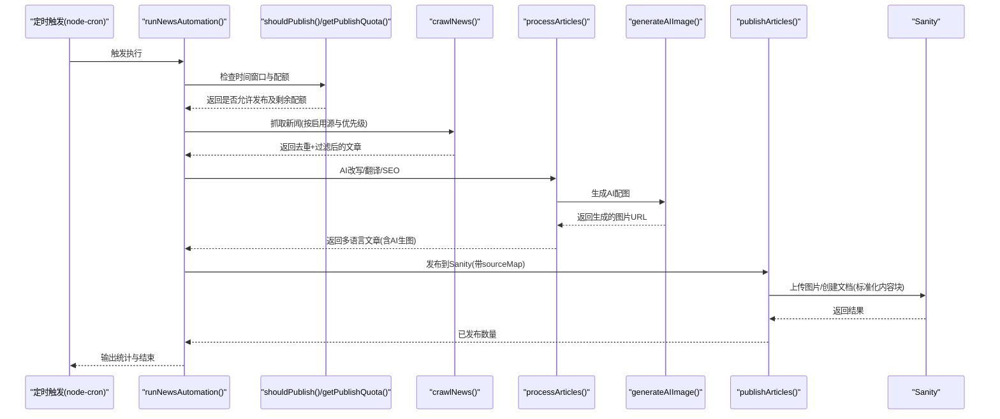

**图表来源**
- [scripts/news-auto/index.ts:9-78](file://scripts/news-auto/index.ts#L9-L78)
- [scripts/news-auto/scheduler.ts:67-94](file://scripts/news-auto/scheduler.ts#L67-L94)
- [scripts/news-auto/crawler.ts:163-204](file://scripts/news-auto/crawler.ts#L163-L204)
- [scripts/news-auto/ai-processor.ts:358-374](file://scripts/news-auto/ai-processor.ts#L358-L374)
- [scripts/news-auto/publisher.ts:255-286](file://scripts/news-auto/publisher.ts#L255-L286)

## 详细组件分析

### 新闻自动化主流程
- 功能要点
  - 时间窗口与配额检查：确保在目标市场北京时间范围内且未超过每日上限
  - 抓取与配额裁剪：按剩余配额限制处理数量
  - AI 处理与发布：生成多语言内容与 SEO 信息，包含AI图像生成，发布到 Sanity
  - 统计输出：记录抓取、处理、发布与剩余配额
- 错误处理：捕获异常并抛出，便于外部监控告警

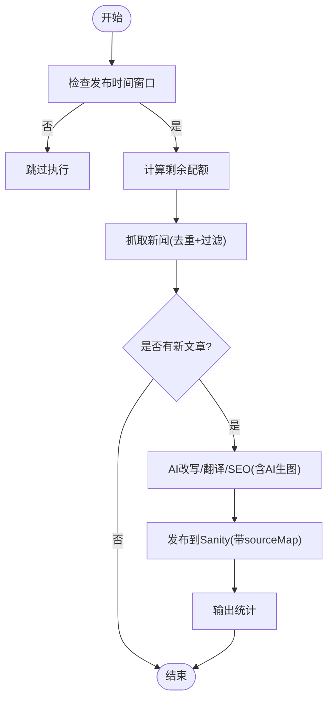

**图表来源**
- [scripts/news-auto/index.ts:9-78](file://scripts/news-auto/index.ts#L9-L78)
- [scripts/news-auto/scheduler.ts:67-94](file://scripts/news-auto/scheduler.ts#L67-L94)
- [scripts/news-auto/crawler.ts:163-204](file://scripts/news-auto/crawler.ts#L163-L204)
- [scripts/news-auto/ai-processor.ts:358-374](file://scripts/news-auto/ai-processor.ts#L358-L374)
- [scripts/news-auto/publisher.ts:255-286](file://scripts/news-auto/publisher.ts#L255-L286)

**章节来源**
- [scripts/news-auto/index.ts:9-78](file://scripts/news-auto/index.ts#L9-L78)

### 爬虫模块（新闻）
- 抓取策略
  - RSS 源：解析 RSS，提取标题、链接、内容、摘要、发布时间、封面图
  - 网页源：使用选择器定位列表项，提取标题、链接、摘要与图片
  - 图片优先级：enclosure/media:content > 内容中首张图 > 相对路径修正
- 过滤与去重
  - 基于关键词集合进行必要词与排除词过滤
  - 基于链接去重
  - 按新闻源优先级排序
- 配置来源：独立配置文件，支持启用/停用、优先级、headers、分类与语言

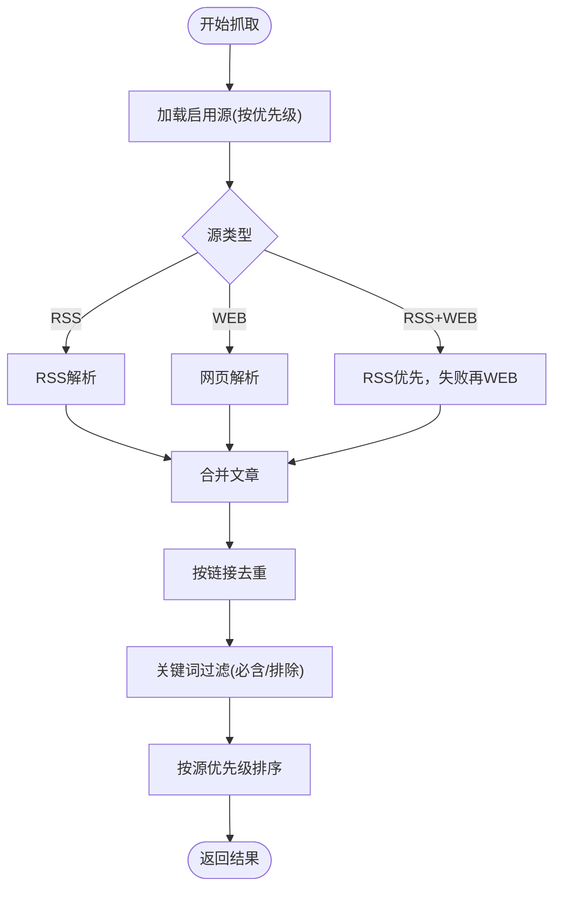

**图表来源**
- [scripts/news-auto/crawler.ts:30-204](file://scripts/news-auto/crawler.ts#L30-L204)
- [scripts/news-auto/news-sources.config.ts:126-144](file://scripts/news-auto/news-sources.config.ts#L126-L144)

**章节来源**
- [scripts/news-auto/crawler.ts:30-204](file://scripts/news-auto/crawler.ts#L30-L204)
- [scripts/news-auto/news-sources.config.ts:1-145](file://scripts/news-auto/news-sources.config.ts#L1-L145)

### AI 处理模块
- 改写与翻译
  - 中文改写：基于模板提示词，生成专业、客观、适合 B2B 的中文文章
  - 多语言翻译：对标题、摘要、正文进行翻译，失败时回退到英文或中文
- SEO 与关键词
  - 自动生成英文关键词列表
  - 生成 metaTitle/metaDescription 与 keywords
- AI 图像生成
  - 集成通义万相API，支持异步任务处理
  - 自动生成图像描述prompt，确保与文章内容相关
  - 支持图片生成失败时的回退机制
- 质量控制
  - 配额与时间窗口已在上游控制并发与数量
  - 通过提示词约束字数与风格

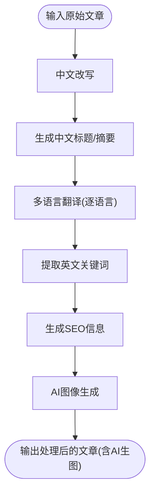

**图表来源**
- [scripts/news-auto/ai-processor.ts:270-354](file://scripts/news-auto/ai-processor.ts#L270-L354)
- [scripts/news-auto/ai-processor.ts:157-234](file://scripts/news-auto/ai-processor.ts#L157-L234)

**章节来源**
- [scripts/news-auto/ai-processor.ts:23-62](file://scripts/news-auto/ai-processor.ts#L23-L62)
- [scripts/news-auto/ai-processor.ts:270-354](file://scripts/news-auto/ai-processor.ts#L270-L354)

### 发布模块（Sanity）
- 去重检查：基于URL和中文标题双重检查确保内容唯一性
- 分类解析：按分类 slug 获取分类 ID
- 图片上传：下载远程图片并上传到 Sanity Assets
- 文档构建：采用标准化内容块结构，支持多语言内容
- 批量发布：逐条发布并延时避免限流

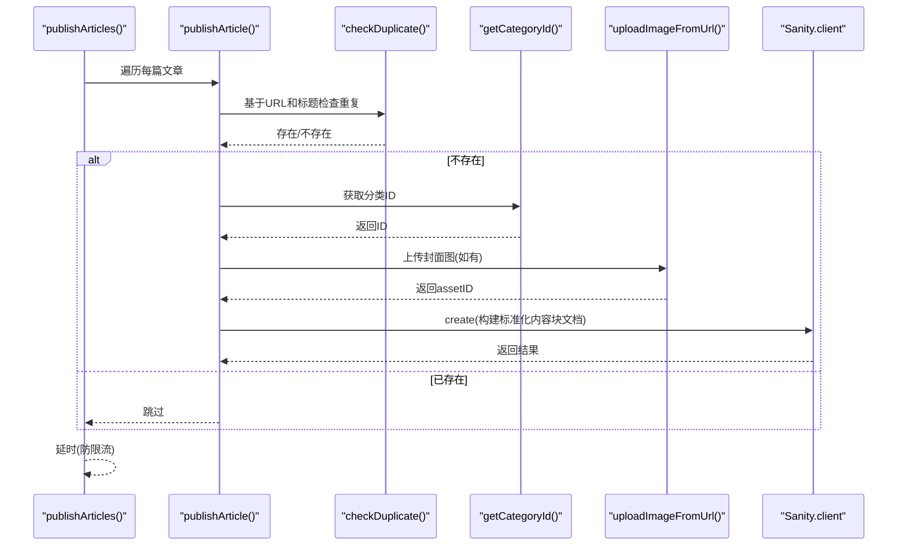

**图表来源**
- [scripts/news-auto/publisher.ts:75-286](file://scripts/news-auto/publisher.ts#L75-L286)

**章节来源**
- [scripts/news-auto/publisher.ts:14-286](file://scripts/news-auto/publisher.ts#L14-L286)

### 调度模块（时间窗口与配额）
- 时间窗口：将 UTC 转换为北京时间，判断是否在设定时间段内（±90 分钟容差）
- 每日配额：查询当天自动生成文章数量，计算剩余配额
- 测试模式：可通过环境变量绕过时间检查，便于本地调试

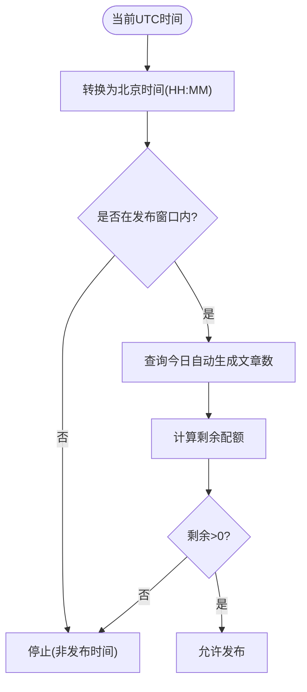

**图表来源**
- [scripts/news-auto/scheduler.ts:29-94](file://scripts/news-auto/scheduler.ts#L29-L94)

**章节来源**
- [scripts/news-auto/scheduler.ts:7-20](file://scripts/news-auto/scheduler.ts#L7-L20)
- [scripts/news-auto/scheduler.ts:29-94](file://scripts/news-auto/scheduler.ts#L29-L94)

### 新闻源配置
- 结构化配置：name/url/type/rss/selector/category/language/priority/enabled/headers/notes
- 查询接口：按启用状态、分类、语言筛选，按 priority 排序
- 维护建议：新增源在数组中添加，停用设 enabled=false，调整优先级修改 priority

**章节来源**
- [scripts/news-auto/news-sources.config.ts:17-144](file://scripts/news-auto/news-sources.config.ts#L17-L144)

### 产品数据导入与初始化
- 光莆官网爬取：遍历分类页与分页，抓取产品列表与详情，解析卖点、应用、规格、图片等
- 转换导入：将原始数据转换为 Sanity 结构（产品/规格/分类），批量 createOrReplace
- 示例导入：提供静态数据的导入脚本，便于快速验证
- 种子数据：初始化核心分类与20个核心产品，便于演示与测试

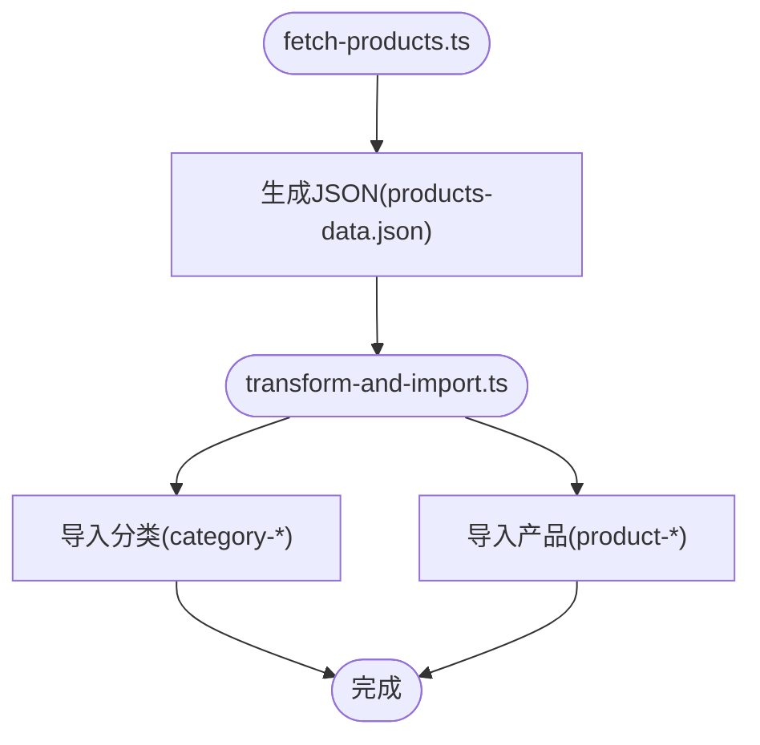

**图表来源**
- [scripts/crawler/fetch-products.ts:241-306](file://scripts/crawler/fetch-products.ts#L241-L306)
- [scripts/crawler/transform-and-import.ts:175-230](file://scripts/crawler/transform-and-import.ts#L175-L230)
- [scripts/import-products.ts:64-158](file://scripts/import-products.ts#L64-L158)
- [scripts/seed-categories.ts:83-107](file://scripts/seed-categories.ts#L83-L107)
- [scripts/seed-products.ts:463-519](file://scripts/seed-products.ts#L463-L519)

**章节来源**
- [scripts/crawler/fetch-products.ts:69-306](file://scripts/crawler/fetch-products.ts#L69-L306)
- [scripts/crawler/transform-and-import.ts:55-230](file://scripts/crawler/transform-and-import.ts#L55-L230)
- [scripts/import-products.ts:64-158](file://scripts/import-products.ts#L64-L158)
- [scripts/seed-categories.ts:83-107](file://scripts/seed-categories.ts#L83-L107)
- [scripts/seed-products.ts:463-519](file://scripts/seed-products.ts#L463-L519)

## 工业模板配置系统

### 行业预设配置
工业模板系统提供四种行业预设，每种预设包含特定的功能组合、内容类型和文件结构：

- **制造业 (manufacturing)**
  - 功能：产品中心、资讯中心、地理SEO、联系表单
  - 内容类型：产品、分类、文章
  - 特点：以产品展示为主，技术参数详细

- **服务业 (service)**
  - 功能：资讯中心、地理SEO、联系表单
  - 内容类型：文章
  - 特点：案例展示、专业内容，通常不需要产品

- **零售业 (retail)**
  - 功能：产品中心、资讯中心、联系表单
  - 内容类型：产品、分类
  - 特点：产品目录、在线购买引导

- **科技行业 (technology)**
  - 功能：产品中心、资讯中心、地理SEO
  - 内容类型：产品、文章
  - 特点：产品介绍、技术文档

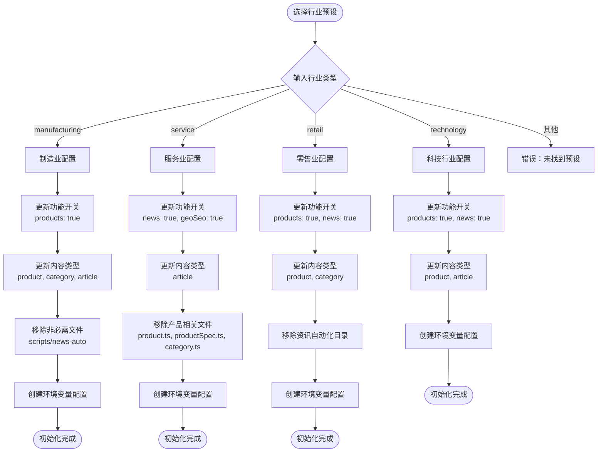

**图表来源**
- [scripts/setup-industry.js:18-43](file://scripts/setup-industry.js#L18-L43)
- [scripts/setup-industry.js:45-105](file://scripts/setup-industry.js#L45-L105)

**章节来源**
- [scripts/setup-industry.js:18-43](file://scripts/setup-industry.js#L18-L43)
- [scripts/setup-industry.js:45-105](file://scripts/setup-industry.js#L45-L105)

### 水暖卫浴行业专用配置
水暖卫浴行业提供专门的初始化脚本，包含行业特定的产品分类、关键词、术语库和SEO优化建议：

- **产品分类体系**：涵盖水龙头、花洒系统、智能马桶、面盆与水槽、浴室家具、水暖五金等六大类
- **关键词优化**：提供中英文关键词库，支持AI自动翻译和SEO优化
- **术语库**：预置专业术语对照表，确保AI翻译的专业性
- **Prompt模板**：提供针对不同产品的AI生图Prompt模板

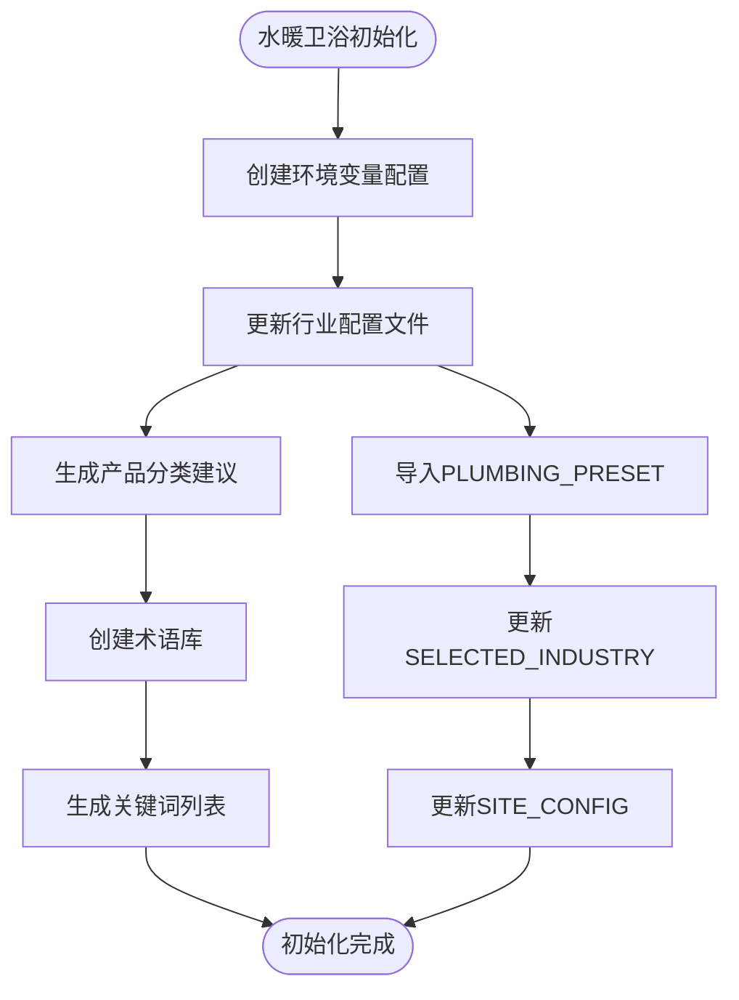

**图表来源**
- [scripts/setup-plumbing.js:17-62](file://scripts/setup-plumbing.js#L17-L62)
- [scripts/setup-plumbing.js:64-99](file://scripts/setup-plumbing.js#L64-L99)

**章节来源**
- [scripts/setup-plumbing.js:1-100](file://scripts/setup-plumbing.js#L1-L100)

## 部署与配置指南

### 30分钟快速部署流程
工业模板系统提供完整的30分钟部署指南，包含以下步骤：

1. **选择行业模板**（1分钟）
   - 使用 `npm run setup:industry [industry-name]` 命令
   - 支持制造业、服务业、零售业、科技行业四种预设

2. **配置Sanity CMS**（5分钟）
   - 创建新项目并获取Project ID和API Token
   - 在`.env.local`中配置环境变量

3. **启动开发环境**（2分钟）
   - 启动网站：`npm run dev`
   - 启动CMS：`npm run sanity`

4. **添加初始内容**（10分钟）
   - 在Sanity Studio中添加产品分类和产品
   - 配置公司信息和联系方式

5. **部署上线**（10分钟）
   - 推送到GitHub
   - 在Vercel中导入项目并配置环境变量

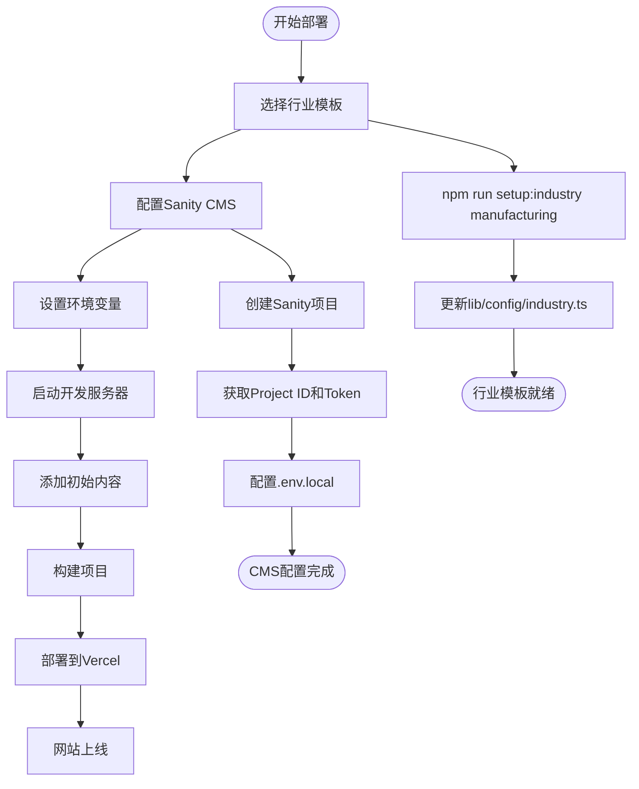

**图表来源**
- [DEPLOYMENT_GUIDE.md:7-19](file://DEPLOYMENT_GUIDE.md#L7-L19)
- [DEPLOYMENT_GUIDE.md:21-35](file://DEPLOYMENT_GUIDE.md#L21-L35)
- [DEPLOYMENT_GUIDE.md:36-46](file://DEPLOYMENT_GUIDE.md#L36-L46)
- [DEPLOYMENT_GUIDE.md:47-55](file://DEPLOYMENT_GUIDE.md#L47-L55)
- [DEPLOYMENT_GUIDE.md:69-88](file://DEPLOYMENT_GUIDE.md#L69-L88)

**章节来源**
- [DEPLOYMENT_GUIDE.md:1-253](file://DEPLOYMENT_GUIDE.md#L1-L253)
- [多行业模板使用指南.md:13-30](file://多行业模板使用指南.md#L13-L30)
- [水暖卫浴行业使用指南.md:4-15](file://水暖卫浴行业使用指南.md#L4-L15)

### 多行业模板使用指南
多行业模板提供详细的使用指南，包括：

- **行业选择矩阵**：四种行业的适用场景和推荐配置
- **自定义配置**：品牌信息、颜色主题、多语言支持
- **部署选项**：Vercel、Netlify、自建服务器等多种部署方式
- **SEO优化**：自动化的SEO功能和手动优化建议

**章节来源**
- [多行业模板使用指南.md:1-347](file://多行业模板使用指南.md#L1-L347)

### 水暖卫浴行业专用指南
水暖卫浴行业提供专门的使用指南，包含：

- **产品分类体系**：详细的分类层次和产品类型
- **SEO优化建议**：针对水暖卫浴行业的页面标题格式和Meta描述模板
- **AI内容生成**：专业术语库和Prompt模板
- **GEO-SEO优化**：行业优化的llms.txt文件生成

**章节来源**
- [水暖卫浴行业使用指南.md:1-397](file://水暖卫浴行业使用指南.md#L1-L397)

## 依赖关系分析
- 外部库
  - rss-parser：RSS 解析
  - axios/cheerio：HTTP 抓取与 DOM 解析
  - jsdom：网页解析（产品爬取）
  - @sanity/client：Sanity API
  - node-cron：定时任务（建议使用）
  - dotenv：环境变量加载
- 模块间耦合
  - index.ts 依赖 scheduler、crawler、ai-processor、publisher
  - crawler 依赖 news-sources.config 与 config
  - ai-processor 依赖 config 与通义千问 API、通义万相 API
  - publisher 依赖 config 与 sanity/client
  - 产品导入链路相互独立，与新闻自动化无直接耦合
  - 工业模板配置脚本独立运行，不依赖现有自动化流程

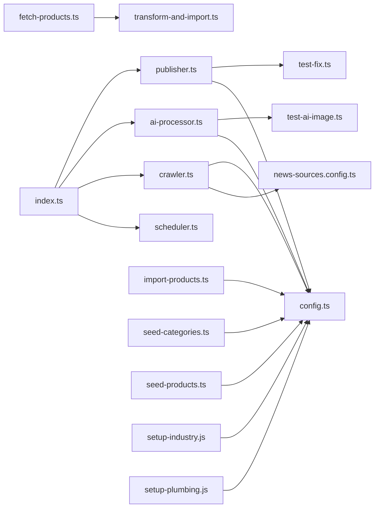

**图表来源**
- [scripts/news-auto/index.ts:1-7](file://scripts/news-auto/index.ts#L1-L7)
- [scripts/news-auto/crawler.ts:1-6](file://scripts/news-auto/crawler.ts#L1-L6)
- [scripts/news-auto/ai-processor.ts:1-3](file://scripts/news-auto/ai-processor.ts#L1-L3)
- [scripts/news-auto/publisher.ts:1-2](file://scripts/news-auto/publisher.ts#L1-L2)
- [scripts/news-auto/news-sources.config.ts:1-145](file://scripts/news-auto/news-sources.config.ts#L1-L145)
- [scripts/news-auto/config.ts:1-45](file://scripts/news-auto/config.ts#L1-L45)
- [scripts/crawler/fetch-products.ts:1-320](file://scripts/crawler/fetch-products.ts#L1-L320)
- [scripts/crawler/transform-and-import.ts:1-254](file://scripts/crawler/transform-and-import.ts#L1-L254)
- [scripts/import-products.ts:1-161](file://scripts/import-products.ts#L1-L161)
- [scripts/seed-categories.ts:1-110](file://scripts/seed-categories.ts#L1-L110)
- [scripts/seed-products.ts:1-522](file://scripts/seed-products.ts#L1-L522)
- [scripts/setup-industry.js:1-160](file://scripts/setup-industry.js#L1-L160)
- [scripts/setup-plumbing.js:1-100](file://scripts/setup-plumbing.js#L1-L100)

**章节来源**
- [package.json:12-28](file://package.json#L12-L28)

## 性能考量
- 并发与限流
  - 发布与 AI 处理均设置了延时，避免 API 限流与服务端压力
  - 建议在生产环境结合 node-cron 的并发策略与重试机制
- 网络与解析
  - 抓取超时与错误重试策略需在上游配置
  - RSS 与网页解析的稳定性取决于目标站点结构变化
- 存储与索引
  - 发布前的重复检查与分类查询会增加查询开销，建议在 Sanity 端确保相关字段建立索引
- 配额与窗口
  - 合理设置每日配额与发布时间窗口，避免突发流量导致限流或延迟
- AI 图像生成
  - 采用异步任务处理，支持轮询等待，避免阻塞主流程
  - 实现回退机制，确保即使AI生图失败也能正常发布
- 工业模板配置
  - 初始化脚本采用文件系统操作，建议在空闲时段执行
  - 配置更新采用字符串替换，性能开销较小

## 故障排除指南
- 新闻抓取失败
  - 检查新闻源 headers（如 UA）与 RSS/网页可用性
  - 使用测试脚本验证 RSS 可用性与关键词匹配
- AI 处理报错
  - 确认通义千问 API Key 环境变量配置正确
  - 检查提示词与模型参数是否合理
- AI 图像生成失败
  - 确认通义万相 API Key 环境变量配置正确
  - 检查网络连接和API服务状态
  - 使用专门的AI图像生成功能测试脚本进行诊断
- 发布失败
  - 检查分类 slug 是否存在、图片下载是否成功
  - 查看 Sanity 返回的错误信息，确认文档结构与字段类型
  - 确认内容块结构符合Sanity schema要求
- 产品导入异常
  - 确认分类 ID 映射正确，产品 JSON 文件存在
  - 检查 Sanity Token 权限与 API 版本
- 调度问题
  - 本地测试可设置绕过时间检查的环境变量
  - 在 Vercel/Cron 环境下注意时区转换与 ±1 小时浮动误差
- 工业模板配置问题
  - 检查Node.js版本是否满足脚本要求
  - 确认目标文件是否存在且有写权限
  - 验证行业名称是否在预设列表中
- 部署问题
  - 检查Vercel环境变量配置是否正确
  - 确认Sanity项目ID和Token有效
  - 验证域名配置和DNS设置

**章节来源**
- [scripts/test-news.js:5-37](file://scripts/test-news.js#L5-L37)
- [scripts/news-auto/ai-processor.ts:23-62](file://scripts/news-auto/ai-processor.ts#L23-L62)
- [scripts/news-auto/publisher.ts:14-286](file://scripts/news-auto/publisher.ts#L14-L286)
- [scripts/crawler/transform-and-import.ts:233-251](file://scripts/crawler/transform-and-import.ts#L233-L251)
- [scripts/news-auto/scheduler.ts:30-34](file://scripts/news-auto/scheduler.ts#L30-L34)
- [scripts/test-ai-image.ts:28-142](file://scripts/test-ai-image.ts#L28-L142)
- [DEPLOYMENT_GUIDE.md:219-242](file://DEPLOYMENT_GUIDE.md#L219-L242)

## 结论
本自动化工具体系以"配置驱动 + 流水线编排"为核心，现已扩展为包含工业模板配置系统的完整解决方案，覆盖五大业务域：
- 新闻自动化：具备完善的抓取、过滤、AI 处理、AI 图像生成、发布与调度能力，适配多源、多语言与多分类场景
- 产品数据导入：提供从官网爬取到 Sanity 导入的完整链路，支持种子数据初始化
- 种子数据生成：初始化产品分类与核心产品，便于快速搭建演示与测试环境
- 工业模板配置：支持四种行业预设的一键初始化，提供水暖卫浴行业专用配置
- 部署与运维：提供完整的30分钟部署指南和多行业使用指南

**更新** 新增工业模板配置系统，包含四种行业预设和水暖卫浴行业专用配置；新增完整的部署指南文档，涵盖30分钟快速部署流程；增强系统的可扩展性和易用性。

建议在生产环境中结合 node-cron 的调度策略、完善的日志与告警、以及定期的配置与数据健康检查，持续优化性能与稳定性。

## 附录
- 定时任务配置（node-cron 使用建议）
  - 在 Vercel/Cron 环境下，注意 UTC 与目标市场时区转换
  - 设置合理的执行周期与容差窗口，避免 ±1 小时浮动带来的偏差
  - 结合 shouldPublish 的时间窗口与配额控制，确保任务在合适的时间窗口内执行
- 监控与日志
  - 在关键步骤输出统计信息（抓取/处理/发布数量）
  - 对异常进行统一捕获与上报，便于快速定位问题
  - 新增AI图像生成功能的详细日志记录
  - 工业模板配置脚本添加详细的进度输出
- 数据清理与维护
  - 定期检查重复文章与重复产品，清理无效数据
  - 对图片资源进行去重与失效检测，保持存储整洁
  - 监控AI图像生成成功率，及时发现API问题
  - 定期检查工业模板配置的完整性
- 性能调优
  - 合理设置并发与延时，避免触发第三方限流
  - 对 RSS 与网页解析的稳定性进行监控与降级策略设计
  - 优化AI图像生成的轮询策略，平衡响应速度与成本
  - 工业模板配置采用异步文件操作，避免阻塞主流程
- 工业模板配置测试
  - 使用专门的测试脚本验证配置更新的正确性
  - 提供快速测试和详细测试两种模式
  - 支持批量测试和成功率统计
- 部署最佳实践
  - 使用Vercel进行零配置部署，享受全球CDN加速
  - 在生产环境配置适当的缓存策略和安全头
  - 定期备份Sanity内容和数据库
  - 建立监控告警机制，及时发现和解决问题