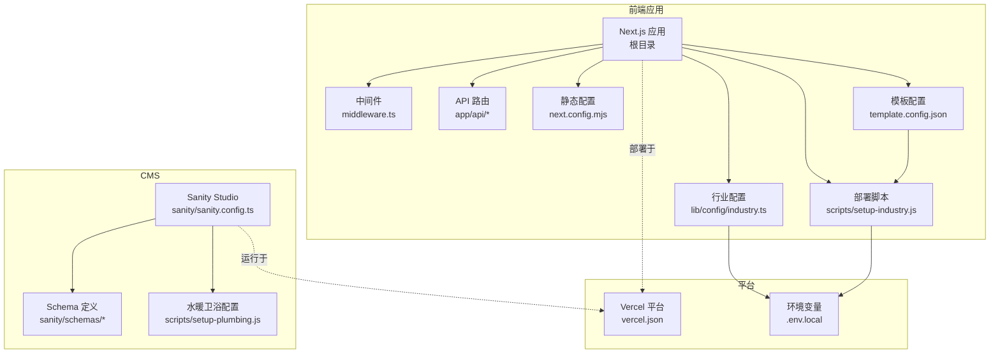
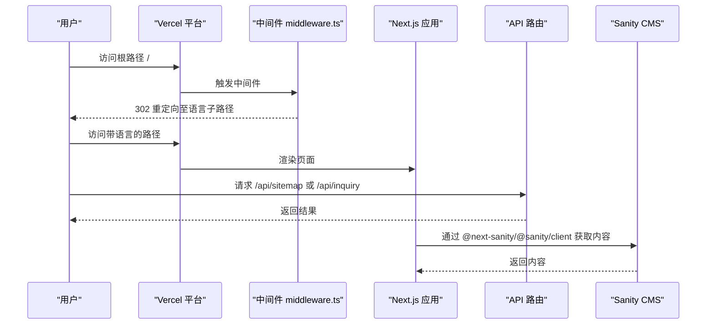
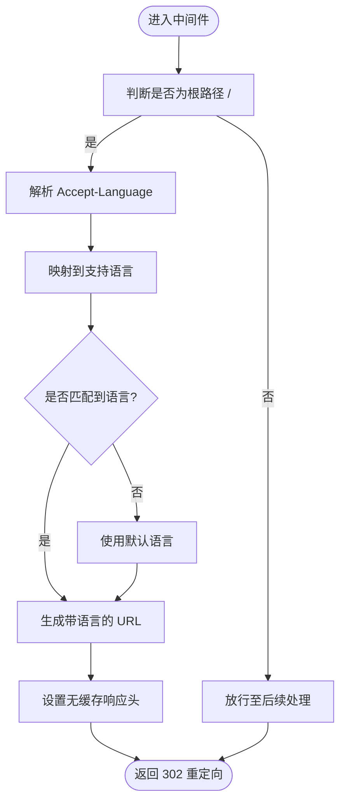
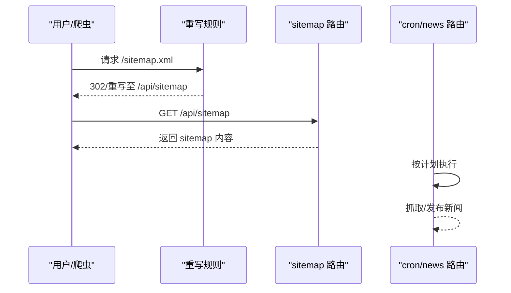
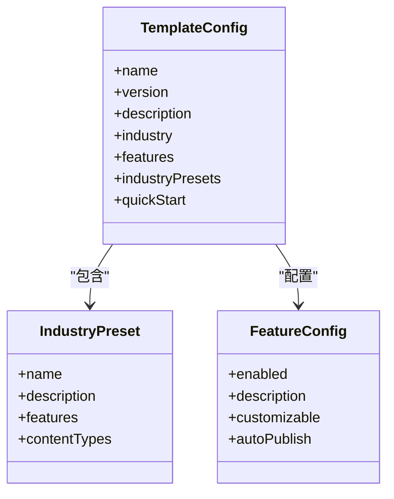
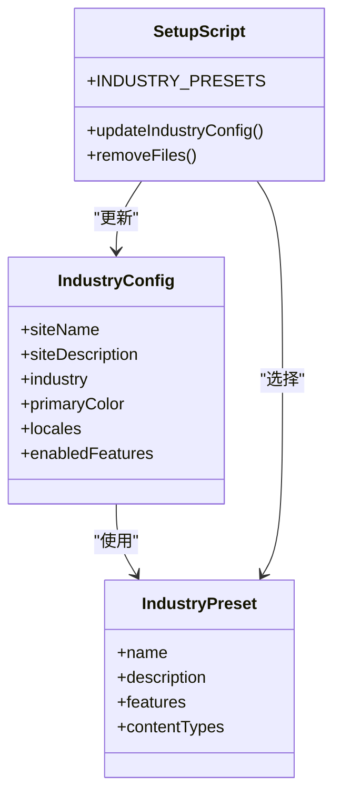
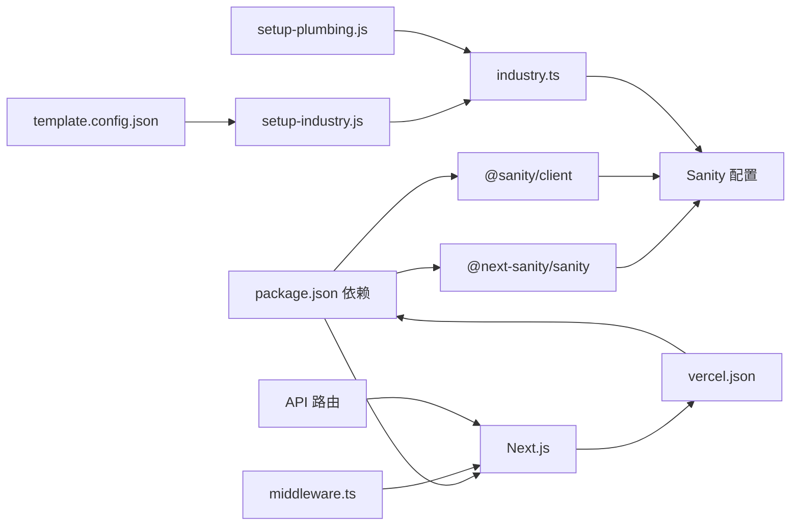

# 部署和运维

<cite>
**本文引用的文件**
- [DEPLOYMENT_GUIDE.md](file://DEPLOYMENT_GUIDE.md)
- [TEMPLATE_README.md](file://TEMPLATE_README.md)
- [多行业模板使用指南.md](file://多行业模板使用指南.md)
- [水暖卫浴行业使用指南.md](file://水暖卫浴行业使用指南.md)
- [vercel.json](file://vercel.json)
- [package.json](file://package.json)
- [next.config.mjs](file://next.config.mjs)
- [middleware.ts](file://middleware.ts)
- [lib/config/industry.ts](file://lib/config/industry.ts)
- [scripts/setup-industry.js](file://scripts/setup-industry.js)
- [scripts/setup-plumbing.js](file://scripts/setup-plumbing.js)
- [sanity/sanity.config.ts](file://sanity/sanity.config.ts)
- [sanity/schemas/product.ts](file://sanity/schemas/product.ts)
- [sanity/schemas/article.ts](file://sanity/schemas/article.ts)
- [sanity/schemas/category.ts](file://sanity/schemas/category.ts)
- [sanity/schemas/index.ts](file://sanity/schemas/index.ts)
- [template.config.json](file://template.config.json)
- [app/api/cron/news/route.ts](file://app/api/cron/news/route.ts)
- [app/api/sitemap/route.ts](file://app/api/sitemap/route.ts)
- [app/api/inquiry/route.tsx](file://app/api/inquiry/route.tsx)
- [lib/analytics/GoogleAnalytics.tsx](file://lib/analytics/GoogleAnalytics.tsx)
- [components/forms/InquiryForm.tsx](file://components/forms/InquiryForm.tsx)
- [tailwind.config.js](file://tailwind.config.js)
</cite>

## 更新摘要
**所做更改**
- 新增多行业模板部署基础设施的完整文档
- 更新行业预设配置和模板元数据说明
- 增加模板配置文件和行业特定配置系统的详细说明
- 完善多行业模板的部署流程和最佳实践
- 新增模板配置管理和行业切换机制

## 目录
1. [简介](#简介)
2. [30分钟快速部署流程](#30分钟快速部署流程)
3. [项目结构](#项目结构)
4. [核心组件](#核心组件)
5. [架构总览](#架构总览)
6. [详细组件分析](#详细组件分析)
7. [多行业模板系统](#多行业模板系统)
8. [行业特定配置](#行业特定配置)
9. [性能优化建议](#性能优化建议)
10. [依赖关系分析](#依赖关系分析)
11. [故障排除指南](#故障排除指南)
12. [结论](#结论)
13. [附录](#附录)

## 简介
本指南面向 GoPro Trade 网站的部署与运维团队，涵盖以下主题：
- **30分钟快速部署流程**：从零开始到上线的完整操作指南
- **多行业模板系统**：制造业、服务业、零售业、科技行业等专业化模板配置
- **模板配置管理**：基于 template.config.json 的模板元数据和功能开关
- **行业特定配置**：针对不同行业的定制化配置和部署流程
- **水暖卫浴行业专用指南**：针对特定行业的深度配置和优化
- **Vercel 部署配置**：环境变量、构建命令、重写规则、Cron 调度、安全响应头等
- **生产环境运维**：环境变量管理、日志与错误监控、性能监控建议
- **Sanity CMS 部署与管理**：项目 ID/数据集配置、内容预览与发布、版本控制与协作
- **CI/CD 实践**：自动化测试、构建验证、部署策略建议
- **监控与告警**：APM、错误追踪、用户行为分析工具建议
- **故障排除与应急响应**：常见问题诊断、性能问题排查、安全事件处理
- **备份与灾难恢复**：数据备份策略与恢复流程

## 30分钟快速部署流程

### 第一步：选择行业模板（1分钟）
根据业务类型选择合适的行业预设：

```bash
# 制造业
npm run setup:industry manufacturing

# 服务业  
npm run setup:industry service

# 零售业
npm run setup:industry retail

# 科技行业
npm run setup:industry technology
```

### 第二步：配置 Sanity CMS（5分钟）
1. 访问 https://www.sanity.io/manage
2. 创建新项目，选择空白项目
3. 获取 Project ID 和 API Token
4. 在 `.env.local` 中配置环境变量

### 第三步：环境变量配置（2分钟）
编辑 `.env.local` 文件：

```env
NEXT_PUBLIC_SANITY_PROJECT_ID=你的 project_id
NEXT_PUBLIC_SANITY_DATASET=production
SANITY_API_TOKEN=你的 api_token
NEXT_PUBLIC_SITE_URL=https://yourdomain.com
```

### 第四步：启动开发环境（2分钟）
```bash
# 终端1：启动网站
npm run dev

# 终端2：启动 CMS
npm run sanity
```

访问：
- http://localhost:3000 （网站）
- http://localhost:3333 （CMS 后台）

### 第五步：添加初始内容（10分钟）
在 Sanity Studio 中添加：
- 产品分类
- 产品/服务
- 关于页面内容
- 联系信息

### 第六步：部署上线（10分钟）
#### Vercel 部署
1. 推送代码到 GitHub
2. 在 Vercel 导入项目
3. 添加环境变量
4. 点击 Deploy
5. 配置自定义域名

**总计：30分钟快速上线！**

## 项目结构
该仓库采用 Next.js 应用与 Sanity CMS 分离的双工程结构：
- 前端应用位于根目录，使用 Next.js 14，默认框架为 Next.js
- Sanity CMS 位于 sanity 子目录，独立运行与部署
- 关键配置集中在 vercel.json、next.config.mjs、sanity/sanity.config.ts 等文件
- 支持多行业模板和水暖卫浴行业专用配置



**图表来源**
- [vercel.json:1-44](file://vercel.json#L1-L44)
- [package.json:1-46](file://package.json#L1-L46)
- [lib/config/industry.ts:1-65](file://lib/config/industry.ts#L1-L65)
- [scripts/setup-industry.js:1-160](file://scripts/setup-industry.js#L1-L160)
- [template.config.json:1-88](file://template.config.json#L1-L88)
- [sanity/sanity.config.ts:1-33](file://sanity/sanity.config.ts#L1-L33)

**章节来源**
- [vercel.json:1-44](file://vercel.json#L1-L44)
- [package.json:1-46](file://package.json#L1-L46)
- [lib/config/industry.ts:1-65](file://lib/config/industry.ts#L1-L65)
- [scripts/setup-industry.js:1-160](file://scripts/setup-industry.js#L1-L160)
- [template.config.json:1-88](file://template.config.json#L1-L88)
- [sanity/sanity.config.ts:1-33](file://sanity/sanity.config.ts#L1-L33)

## 核心组件
- **Vercel 配置**：定义构建命令、开发命令、安装参数、框架类型、地区、安全响应头、重写规则、Cron 调度
- **Next.js 配置**：图片优化、压缩、响应头、实验性优化
- **中间件**：基于浏览器语言的根路径重定向与缓存控制
- **API 路由**：站点地图生成、询盘提交、新闻 Cron 调度
- **多行业模板系统**：支持制造业、服务业、零售业、科技行业等模板配置
- **模板配置管理**：基于 JSON 的模板元数据和功能开关控制系统
- **行业配置系统**：动态配置和功能开关管理
- **部署脚本**：自动化行业模板初始化和文件清理
- **Sanity 配置**：项目 ID/数据集来源、Schema 类型注册、国际化界面
- **Analytics**：Google Analytics 组件接入

**章节来源**
- [vercel.json:1-44](file://vercel.json#L1-L44)
- [next.config.mjs:1-65](file://next.config.mjs#L1-L65)
- [middleware.ts:1-68](file://middleware.ts#L1-L68)
- [lib/config/industry.ts:1-65](file://lib/config/industry.ts#L1-L65)
- [template.config.json:1-88](file://template.config.json#L1-L88)
- [scripts/setup-industry.js:1-160](file://scripts/setup-industry.js#L1-L160)
- [sanity/sanity.config.ts:1-33](file://sanity/sanity.config.ts#L1-L33)
- [lib/analytics/GoogleAnalytics.tsx](file://lib/analytics/GoogleAnalytics.tsx)

## 架构总览
下图展示了前端应用、API 路由、中间件与 Vercel 平台之间的交互关系。



**图表来源**
- [middleware.ts:44-63](file://middleware.ts#L44-L63)
- [app/api/sitemap/route.ts](file://app/api/sitemap/route.ts)
- [app/api/inquiry/route.tsx](file://app/api/inquiry/route.tsx)
- [sanity/sanity.config.ts:7-16](file://sanity/sanity.config.ts#L7-L16)

## 详细组件分析

### Vercel 部署配置
- **构建与开发命令**：通过 vercel.json 显式指定构建、开发与安装命令，确保一致的构建环境
- **框架类型**：声明为 Next.js，便于平台优化
- **地区选择**：指定新加坡区域以优化亚太地区访问延迟
- **安全响应头**：对所有请求注入安全相关响应头，增强 XSS、点击劫持防护
- **重写规则**：将 sitemap.xml 请求重写到 /api/sitemap，统一由 API 路由生成
- **Cron 调度**：配置定时任务调用 /api/cron/news，支持多个时间点触发

**章节来源**
- [vercel.json:1-44](file://vercel.json#L1-L44)

### Next.js 运行时配置
- **图片优化**：启用现代图片格式与远程图片模式，配置设备像素比与缓存 TTL
- **压缩**：开启 gzip 压缩以降低传输体积
- **响应头**：为静态资源与字体设置长期缓存；为页面注入安全响应头
- **实验性优化**：按需导入优化以减少打包体积

**章节来源**
- [next.config.mjs:1-65](file://next.config.mjs#L1-L65)

### 中间件与语言重定向
- **功能**：根据浏览器 Accept-Language 自动识别语言，进行 302 临时重定向
- **缓存控制**：对根路径重定向响应禁用缓存，避免错误缓存导致的语言错乱
- **匹配器**：仅对根路径 / 生效



**图表来源**
- [middleware.ts:21-63](file://middleware.ts#L21-L63)

**章节来源**
- [middleware.ts:1-68](file://middleware.ts#L1-L68)

### API 路由与功能
- **站点地图路由**：将动态生成的 sitemap.xml 重写至 /api/sitemap，统一由 API 路由处理
- **询盘提交**：提供表单提交接口，用于收集用户咨询
- **新闻 Cron**：定时拉取与发布新闻，支持多时间点调度



**图表来源**
- [vercel.json:27-32](file://vercel.json#L27-L32)
- [app/api/sitemap/route.ts](file://app/api/sitemap/route.ts)
- [app/api/cron/news/route.ts](file://app/api/cron/news/route.ts)

**章节来源**
- [vercel.json:27-42](file://vercel.json#L27-L42)
- [app/api/sitemap/route.ts](file://app/api/sitemap/route.ts)
- [app/api/cron/news/route.ts](file://app/api/cron/news/route.ts)

### 多行业模板系统
- **模板元数据**：通过 template.config.json 定义所有可用的功能模块和行业预设
- **行业预设管理**：支持制造业、服务业、零售业、科技行业等标准模板
- **功能开关控制**：基于 enabledFeatures 的模块化功能管理
- **内容类型配置**：针对不同行业配置相应的内容类型
- **模板快速启动**：通过 quickStart 配置简化部署流程



**图表来源**
- [template.config.json:1-88](file://template.config.json#L1-L88)

**章节来源**
- [template.config.json:1-88](file://template.config.json#L1-L88)

### 行业配置系统
- **多行业支持**：制造业、服务业、零售业、科技行业四种预设
- **动态配置**：通过 `setup:industry` 脚本自动配置功能开关和文件结构
- **功能开关**：products、news、geoSeo、contactForm 等模块化功能控制
- **语言支持**：默认中英文，可扩展至多语言



**图表来源**
- [lib/config/industry.ts:17-65](file://lib/config/industry.ts#L17-L65)
- [scripts/setup-industry.js:18-43](file://scripts/setup-industry.js#L18-L43)

**章节来源**
- [lib/config/industry.ts:1-65](file://lib/config/industry.ts#L1-L65)
- [scripts/setup-industry.js:1-160](file://scripts/setup-industry.js#L1-L160)

### 水暖卫浴行业专用配置
- **专业术语库**：预置水暖卫浴行业专业词汇
- **产品分类体系**：完整的8大类产品分类
- **SEO优化**：针对水暖卫浴行业的页面标题和描述模板
- **AI生图优化**：专门的Prompt示例和图像生成策略

**章节来源**
- [scripts/setup-plumbing.js:1-100](file://scripts/setup-plumbing.js#L1-L100)
- [sanity/schemas/product.ts:1-233](file://sanity/schemas/product.ts#L1-L233)

### Analytics 与表单
- **Google Analytics**：在应用层集成分析组件
- **询盘表单**：提供前端表单与后端提交接口，便于收集潜在客户信息

**章节来源**
- [lib/analytics/GoogleAnalytics.tsx](file://lib/analytics/GoogleAnalytics.tsx)
- [components/forms/InquiryForm.tsx](file://components/forms/InquiryForm.tsx)
- [app/api/inquiry/route.tsx](file://app/api/inquiry/route.tsx)

## 多行业模板系统

### 模板配置文件
template.config.json 提供了完整的模板元数据管理系统：

**核心功能模块**：
- **核心功能**：所有行业都需要的基础功能
- **产品中心**：适合制造业、零售业等的产品展示功能
- **资讯中心**：支持自动采集和 AI 生成的内容管理
- **GEO-SEO 优化**：AI 搜索引擎优化功能
- **多语言支持**：默认中英文，可扩展至多语言
- **联系表单**：询盘收集功能

**行业预设配置**：
- **制造业**：产品中心 + 资讯中心 + GEO-SEO + 联系表单
- **服务业**：资讯中心 + GEO-SEO + 联系表单
- **零售业**：产品中心 + 资讯中心 + 联系表单
- **科技行业**：产品中心 + 资讯中心 + GEO-SEO

**章节来源**
- [template.config.json:1-88](file://template.config.json#L1-L88)

### 行业预设管理
setup-industry.js 脚本提供了完整的行业模板管理：

**支持的行业**：
- **manufacturing**：制造业（LED、电子、机械等）
- **service**：服务业（咨询、法律、会计等）
- **retail**：零售业（电商、品牌）
- **technology**：科技行业（软件、SaaS、AI）

**自动配置功能**：
- 更新行业配置文件
- 移除不需要的文件
- 复制环境变量模板
- 配置功能开关

**章节来源**
- [scripts/setup-industry.js:1-160](file://scripts/setup-industry.js#L1-L160)

### 快速启动流程
模板提供了简化的 30 分钟部署流程：

**快速开始步骤**：
1. 选择行业模板：`npm run setup:industry [行业]`
2. 修改配置：编辑 `lib/config/industry.ts`
3. 初始化项目：运行 `npm run setup:industry`
4. 配置 Sanity：在后台创建项目
5. 设置环境变量：编辑 `.env.local`

**章节来源**
- [多行业模板使用指南.md:294-304](file://多行业模板使用指南.md#L294-L304)

## 行业特定配置

### 制造业配置
**特点**：产品展示为主，技术参数详细
**推荐配置**：
- ✅ 产品中心
- ✅ 产品分类  
- ✅ 技术规格
- ✅ 联系表单
- ⚠️ 资讯（可选）

### 服务业配置
**特点**：案例展示、专业内容
**推荐配置**：
- ✅ 案例研究
- ✅ 服务介绍
- ✅ 专家团队
- ✅ 联系表单
- ❌ 产品（通常不需要）

### 零售业配置
**特点**：产品目录、在线购买引导
**推荐配置**：
- ✅ 产品目录
- ✅ 产品分类
- ✅ 高清图库
- ✅ 购买链接
- ⚠️ 购物车（需额外开发）

### 科技行业配置
**特点**：产品介绍、技术文档
**推荐配置**：
- ✅ 产品/SaaS
- ✅ 技术文档
- ✅ 案例展示
- ✅ SEO 优化
- ✅ API 文档（可选）

### 水暖卫浴行业深度配置
**专业术语库**：预置300+专业词汇，确保内容专业性
**产品分类体系**：8大类产品，覆盖完整供应链
**SEO优化模板**：针对行业特点的页面标题和描述格式
**AI生图策略**：专门的Prompt模板和图像生成规范

**章节来源**
- [多行业模板使用指南.md:145-188](file://多行业模板使用指南.md#L145-L188)
- [水暖卫浴行业使用指南.md:41-91](file://水暖卫浴行业使用指南.md#L41-L91)
- [水暖卫浴行业使用指南.md:111-140](file://水暖卫浴行业使用指南.md#L111-L140)

## 性能优化建议

### 图片优化
所有图片使用 WebP 格式：
```bash
# 批量转换图片
npm install -g sharp-cli
sharp input.jpg -f webp -o output.webp
```

### SEO 优化
1. **Meta 标签**：每个页面都有独特的 title 和 description
2. **Open Graph**：社交媒体分享优化
3. **结构化数据**：JSON-LD 结构化数据
4. **Sitemap**：自动生成 sitemap.xml

### 缓存策略
生产环境已配置 ISR：
- 产品页：1 小时缓存
- 新闻页：5 分钟缓存  
- 静态页：24 小时缓存

### 行业特定优化
- **制造业**：强调技术参数和产品规格
- **服务业**：突出案例研究和专业团队
- **零售业**：优化产品展示和购买流程
- **科技行业**：强化技术文档和API说明
- **水暖卫浴**：专业术语和SEO优化

**章节来源**
- [DEPLOYMENT_GUIDE.md:191-216](file://DEPLOYMENT_GUIDE.md#L191-L216)
- [多行业模板使用指南.md:231-254](file://多行业模板使用指南.md#L231-L254)

## 依赖关系分析
- 前端应用依赖 Next.js 与 @next-sanity/sanity，通过 @sanity/client 与 Sanity 通信
- Vercel 作为托管平台，负责构建、部署与运行时优化
- 中间件与 API 路由共同构成运行时控制层
- 多行业模板系统通过脚本动态调整功能模块
- 水暖卫浴行业有专门的配置和优化脚本



**图表来源**
- [package.json:13-29](file://package.json#L13-L29)
- [vercel.json:1-44](file://vercel.json#L1-L44)
- [lib/config/industry.ts:1-65](file://lib/config/industry.ts#L1-L65)
- [scripts/setup-industry.js:1-160](file://scripts/setup-industry.js#L1-L160)
- [scripts/setup-plumbing.js:1-100](file://scripts/setup-plumbing.js#L1-L100)
- [template.config.json:1-88](file://template.config.json#L1-L88)

**章节来源**
- [package.json:1-46](file://package.json#L1-L46)
- [vercel.json:1-44](file://vercel.json#L1-L44)
- [lib/config/industry.ts:1-65](file://lib/config/industry.ts#L1-L65)
- [scripts/setup-industry.js:1-160](file://scripts/setup-industry.js#L1-L160)
- [scripts/setup-plumbing.js:1-100](file://scripts/setup-plumbing.js#L1-L100)
- [template.config.json:1-88](file://template.config.json#L1-L88)

## 故障排除指南

### 构建失败
- 检查 vercel.json 中的构建命令与安装命令是否与项目一致
- 确认 Node.js 版本与依赖兼容性
- 验证环境变量配置的完整性

### 语言重定向异常
- 检查浏览器 Accept-Language 是否符合预期
- 确认中间件仅对根路径生效且无缓存头
- 验证 `DEFAULT_LOCALE` 配置

### API 路由不可达
- 确认重写规则是否正确将 /sitemap.xml 重写到 /api/sitemap
- 检查 Cron 调度路径是否与 vercel.json 中配置一致
- 验证 API 路由的权限和访问控制

### Sanity 内容未更新
- 检查项目 ID 与数据集是否正确，确认环境变量优先级
- 确认 Schema 已正确注册并重启 Studio
- 验证 API Token 的权限设置

### 多行业模板问题
- 确认 `setup:industry` 脚本执行成功
- 检查 `industry.ts` 中的功能开关配置
- 验证移除的文件是否正确清理
- 验证 template.config.json 配置正确

### 水暖卫浴行业特殊问题
- 检查 `.env.local` 中的 DASHSCOPE_API_KEY 配置
- 验证专业术语库的导入和使用
- 确认产品分类的完整性和正确性

**章节来源**
- [vercel.json:3-6](file://vercel.json#L3-L6)
- [middleware.ts:44-63](file://middleware.ts#L44-L63)
- [vercel.json:27-42](file://vercel.json#L27-L42)
- [sanity/sanity.config.ts:7-16](file://sanity/sanity.config.ts#L7-L16)
- [scripts/setup-industry.js:67-87](file://scripts/setup-industry.js#L67-L87)
- [template.config.json:1-88](file://template.config.json#L1-L88)
- [水暖卫浴行业使用指南.md:352-359](file://水暖卫浴行业使用指南.md#L352-L359)

## 结论
本指南提供了 GoPro Trade 网站在 Vercel 上的完整部署与运维实践，特别强调了30分钟快速部署流程和多行业模板系统。通过 template.config.json 的模板元数据管理和 setup-industry.js 的自动化配置，能够快速适配不同业务场景。新增的多行业模板基础设施大大简化了部署流程，结合水暖卫浴行业专用配置，能够满足各种专业化需求。建议结合监控与告警工具进一步完善生产环境可观测性，并制定完善的备份与灾难恢复策略。

## 附录

### Vercel 环境变量与部署清单
- **必备环境变量**（建议在 Vercel 控制台配置）
  - SANITY_STUDIO_PROJECT_ID：Sanity 项目 ID
  - SANITY_STUDIO_DATASET：Sanity 数据集名称
  - SANITY_API_TOKEN：Sanity API Token
  - NEXT_PUBLIC_SITE_URL：网站域名
- **公共环境变量**（可在客户端读取）
  - NEXT_PUBLIC_SANITY_PROJECT_ID：客户端可见的项目 ID
  - NEXT_PUBLIC_SANITY_DATASET：客户端可见的数据集
- **行业特定变量**
  - DASHSCOPE_API_KEY：AI生图API密钥（水暖卫浴行业）
  - CONTACT_EMAIL：联系表单接收邮箱
  - SMTP_*：邮件服务器配置

**章节来源**
- [vercel.json:7](file://vercel.json#L7)
- [vercel.json:8-26](file://vercel.json#L8-L26)
- [vercel.json:27-42](file://vercel.json#L27-L42)
- [sanity/sanity.config.ts:7-9](file://sanity/sanity.config.ts#L7-L9)
- [水暖卫浴行业使用指南.md:254-262](file://水暖卫浴行业使用指南.md#L254-L262)

### 多行业模板管理流程
- **选择行业模板**：使用 `npm run setup:industry [行业]` 命令
- **自定义配置**：修改 `lib/config/industry.ts` 中的站点信息
- **功能开关**：通过 enabledFeatures 控制模块启用状态
- **多语言支持**：在 locales 数组中添加支持的语言
- **脚本执行**：运行 `npm run setup:industry` 应用配置
- **模板验证**：检查 template.config.json 配置正确性

**章节来源**
- [scripts/setup-industry.js:45-105](file://scripts/setup-industry.js#L45-L105)
- [lib/config/industry.ts:42-65](file://lib/config/industry.ts#L42-L65)
- [template.config.json:80-86](file://template.config.json#L80-L86)
- [多行业模板使用指南.md:68-134](file://多行业模板使用指南.md#L68-L134)

### 水暖卫浴行业部署清单
- **环境配置**：复制 `.env.plumbing.template` 为 `.env.local`
- **专业术语**：确保 PLUMBING_TERMS 正确导入和使用
- **产品分类**：创建8大类产品分类
- **SEO优化**：配置行业特定的页面标题和描述模板
- **AI集成**：设置 DASHSCOPE_API_KEY 和相关配置

**章节来源**
- [scripts/setup-plumbing.js:17-28](file://scripts/setup-plumbing.js#L17-L28)
- [scripts/setup-plumbing.js:30-62](file://scripts/setup-plumbing.js#L30-L62)
- [水暖卫浴行业使用指南.md:180-218](file://水暖卫浴行业使用指南.md#L180-L218)

### CI/CD 流水线建议
- **自动化测试**：在合并前运行单元测试与集成测试
- **构建验证**：在 PR 中执行构建检查，确保 vercel.json 与 next.config.mjs 无误
- **部署策略**：采用蓝绿部署或滚动更新，配合健康检查
- **安全扫描**：在流水线中加入依赖漏洞扫描与代码质量检查
- **行业验证**：针对不同行业模板的特定配置进行验证

**章节来源**
- [DEPLOYMENT_GUIDE.md:219-242](file://DEPLOYMENT_GUIDE.md#L219-L242)
- [多行业模板使用指南.md:285-289](file://多行业模板使用指南.md#L285-L289)

### 监控与告警
- **应用性能监控（APM）**：建议接入平台内置 APM 或第三方 APM 工具
- **错误追踪**：集成错误上报工具，捕获前端与服务端异常
- **用户行为分析**：结合 Google Analytics 或类似工具，分析用户路径与转化率
- **告警策略**：针对 5xx 错误率、响应时间、吞吐量设置阈值告警
- **行业特定监控**：根据不同行业特点设置相应的监控指标

**章节来源**
- [DEPLOYMENT_GUIDE.md:245-253](file://DEPLOYMENT_GUIDE.md#L245-L253)
- [多行业模板使用指南.md:308-333](file://多行业模板使用指南.md#L308-L333)

### 备份与灾难恢复
- **数据备份**：定期导出 Sanity 数据集，保存至安全存储
- **配置备份**：备份 vercel.json、next.config.mjs、sanity/sanity.config.ts 等关键配置
- **行业配置备份**：保存不同行业模板的配置文件和自定义设置
- **模板配置备份**：保存 template.config.json 和行业预设配置
- **恢复演练**：定期进行恢复演练，验证备份可用性与恢复流程
- **灾难预案**：制定站点停机、内容丢失、安全事件等场景的应急预案

**章节来源**
- [DEPLOYMENT_GUIDE.md:245-253](file://DEPLOYMENT_GUIDE.md#L245-L253)
- [template.config.json:1-88](file://template.config.json#L1-L88)
- [多行业模板使用指南.md:335-347](file://多行业模板使用指南.md#L335-L347)